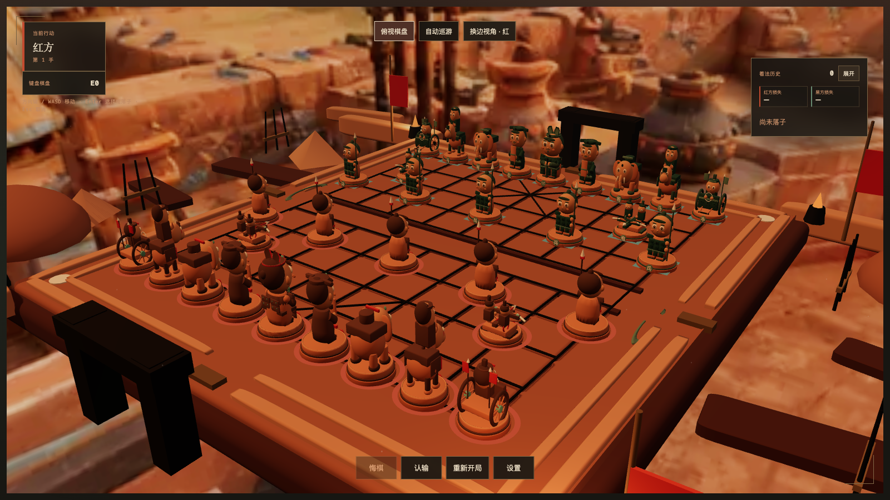

# 网页 3D 中国象棋

[](https://github.com/renyijiu/chinese-chess/actions/workflows/ci.yml)
[](https://github.com/renyijiu/chinese-chess/actions/workflows/codeql.yml)
[](LICENSE)

<p align="center">
  
</p>

这是一个可进行本机双人、纯前端人机对弈，以及可选 WebRTC 好友直连的浏览器 3D 中国象棋。32 枚棋子使用帅/将、仕/士、相/象、车、马、炮、兵/卒七类 Q 版秦兵马俑带骨骼 GLB 资产；棋盘、环境、交互反馈和 HUD 共同采用暖烧陶、黑漆、旧铜、白垩及少量矿物残彩的微缩沙盘语言。

> [!IMPORTANT]
> 项目当前为实验性预发布版本。规则、存档、桌面浏览器对局与生产构建已有自动化验证；高画质 60 FPS p95 门槛和目标手机实机证据尚未关闭，详见 [`docs/validation.md`](docs/validation.md)。

项目采用 [`GPL-3.0-only`](LICENSE)。欢迎通过 [贡献指南](CONTRIBUTING.md) 参与；漏洞请按 [安全策略](SECURITY.md) 私下报告，使用问题请参阅 [支持说明](SUPPORT.md)。

## 3D 棋盘场景

棋盘由 [`BoardSurface.tsx`](components/xiangqi/scene/BoardSurface.tsx) 在 Three.js / React Three Fiber 中程序化构建，不依赖外部棋盘 GLB：

- 九道纵线、十道横线、两座九宫和中央河界按中国象棋结构生成。
- 河界处七条内部纵线断开，最外两条边线保持贯通。
- 炮位与兵卒位使用标准角标；所有落子点只通过 `squareToWorld()` 映射到固定世界坐标，规则和拾取不依赖美术节点。
- 近景使用厚陶棋台、圆角秦砖、黑漆线格、青绿釉河、双重低城垣和瓦当压印；中景道具使用实例化几何，且全部退出棋盘 raycast。
- 远景按画质只加载一张 360° 秦陵沙盘全景；请求失败时局部降级为匹配雾色的主题渐变，棋盘继续可操作。
- 页面提供战场透视、正上方俯视、自动巡游、拖动旋转、滚轮缩放和右键平移。

全景的无损源文件为 [`qin-diorama-panorama-v1.png`](assets/background/qin-diorama-panorama-v1.png)，原创生成说明、用途与限制记录在 [`qin-diorama-panorama-v1.prompt.md`](assets/background/qin-diorama-panorama-v1.prompt.md)。网页只使用 `public/background/` 下的 high / medium / low WebP 变体。

七类正式资产的底座直径约 `0.89` 米，静止姿态最大占地 `0.943` 米，小于 `1.14` 的落子点间距；模型包围盒底面会自动贴合棋盘表面。高/中画质默认加载 LOD1，低画质加载 LOD2。

画质合同保持同一艺术方向并单调降档：

| 档位   | 全景        | 环境细节 | 环境阴影 / 动态光         | 环境运动             |
| ------ | ----------- | -------: | ------------------------- | -------------------- |
| high   | high WebP   |        3 | 完整静态阴影 / 稀疏动态光 | 旗帜、尘粒、釉河     |
| medium | medium WebP |        2 | 降级静态阴影 / 静态灯     | 低频旗帜、尘粒、釉河 |
| low    | low WebP    |        1 | 关闭                      | 关闭                 |

“减少动态效果”是正交覆盖：保留当前档位的静态细节、全景与角色 LOD，只冻结非必要环境运动。

## 技术基线

- React 19 + TypeScript + Vinext/Vite 负责页面和应用层。
- Three.js + React Three Fiber 9 + Drei 负责三维场景、GLB 加载、镜头和交互。
- 正式渲染基线为 WebGL2；WebGPU 暂不作为发布依赖，等生态稳定且目标设备验证通过后再评估。
- 正式运行时资产采用 glTF 2.0/GLB、Meshopt 几何压缩；当前角色没有位图贴图，因此 KTX2 策略明确标记为 N/A，后续加入 BaseColor/Normal/ORM 位图时再启用 ETC1S/UASTC。
- 中国象棋规则实现为与 React/Three.js 解耦的纯 TypeScript 模块，规则状态是棋局唯一真相。

## 本机双人与纯前端人机对战

开始菜单提供本机双人和人机对战，两种模式都不需要应用后端：

- 本机双人保留单步悔棋；人机对局不提供悔棋，避免只撤回人类一手后破坏对局轮次。
- 人机开局用浏览器 Web Crypto 公平掷六面骰，奇数执红、偶数执黑；骰子结果、阵营、难度和棋局一并自动保存，刷新后不会重掷。
- Easy、Normal 和 Hard 都在独立 Web Worker 中搜索，主线程只提交带 revision 的动作；隐藏标签页会暂停启动搜索，超时、异常或畸形 Worker 输出不会提交棋步。
- Master 使用浏览器内 Fairy-Stockfish NNUE WebAssembly。第一次选择时按需下载版本化运行时，约 `12.4 MiB`；验证失败或浏览器能力不足时明确降级到 Hard，并把有效档位写入存档，不会在下次加载时静默升级。
- 动画、音效或 Worker 失败不改变规则状态。规则提交是唯一真相，同一 revision 的表现动作和音频 cue 会去重。

轻量级对手需要现代浏览器的 Web Worker、Web Crypto 和 `localStorage`。Master 另外需要安全上下文、`crossOriginIsolated`、`SharedArrayBuffer`、WebAssembly SIMD、CacheStorage，以及服务端返回 `COOP: same-origin` 与 `COEP: require-corp`。Cloudflare Worker 生产入口已为引擎、NNUE、WASM 和 Worker 脚本固定 MIME、隔离头与版本化缓存策略；缺失资源和 HTML fallback 会保留为错误，不会被当成有效引擎缓存。

Master 发布包和可重现来源位于：

- `public/engines/fairy-stockfish-nnue/1.1.12/manifest.json`：字节数、SHA-256、MIME、URL 和能力合同。
- `third_party/fairy-stockfish-nnue/1.1.12/`：原始 npm 包、对应源码归档、构建说明和 provenance。
- [`THIRD_PARTY_NOTICES.md`](THIRD_PARTY_NOTICES.md)：Fairy-Stockfish 与 NNUE 来源、版本和许可证。
- [`LICENSE`](LICENSE)：本项目采用 `GPL-3.0-only`。

发布前使用 `npm run assets:ai:validate` 校验本地清单，或在具备 Chromium 的维护环境运行 `npm run assets:ai:canary`，验证隔离加载、WASM/NNUE、UCI 协议和合法着法；运行时不会依赖上游网络。

## WebRTC 好友直连（可选）

实验性的好友直连模式以 `RTCDataChannel` 在两台浏览器之间传递版本化棋局命令，不建设匹配大厅、账户系统或权威游戏服务端，也不传输 3D 坐标、动画、VFX 和音频。它默认关闭；部署时设置 `NEXT_PUBLIC_XIANGQI_ONLINE_ENABLED=1`（或 `true`）才会显示入口。

首版使用等待 ICE gathering complete 的手动 non-trickle 信令：房主复制或系统分享完整 Offer 邀请文本，加入方粘贴后生成完整 Answer，房主再粘贴 Answer 建立连接；不超过 2 KiB 的文本还可按需显示二维码作为辅助。双方确认准备后开局，首局房主执红；重开时双方交换红黑。不支持悔棋，支持认输、终局重开、短断线宽限，以及连接失败后重新配对。

STUN 是可选配置，使用逗号分隔：

```bash
NEXT_PUBLIC_XIANGQI_ONLINE_ENABLED=1
NEXT_PUBLIC_XIANGQI_STUN_URLS=stun:stun.example.com:3478,stun:stun-backup.example.com:3478
```

首版只接受 `stun:` URL，不提供 TURN。因此对称 NAT、防火墙严格的企业网络或 UDP 受限网络可能始终无法直连；这是预期限制，不会自动回退到游戏服务端。刷新页面会关闭当前 WebRTC 会话，需要再次交换 Offer/Answer；本地存档只用于重新配对后的严格前缀校验与恢复，不保存 SDP/ICE，也不会在日常走子中接受对方任意完整状态。

邀请/响应文本包含临时 SDP 与 ICE 网络信息，应只发给本局好友并在用后清除。使用第三方 STUN 时，其运营方能够看到请求来源的公网网络元数据。该模式是好友休闲对局，不提供防作弊、旁观、匹配、跨设备账户同步或竞技级断线恢复保证。完整流程、协议边界、故障处理和部署检查见 [`docs/online-friend-match.md`](docs/online-friend-match.md)。

## 资产管线

七类角色依据原创的 [`秦兵马俑阵容概念图`](assets/concepts/xiangqi-characters/qin-terracotta-roster-v1.png) 构建，完整生成提示与使用边界记录在 [`qin-terracotta-roster-v1.prompt.md`](assets/concepts/xiangqi-characters/qin-terracotta-roster-v1.prompt.md)。帅/将采用秦军将领冠，仕/士持竹简与虎符，兵/卒采用秦式层札甲；“炮”保留象棋规则名称，但模型按秦代幻想重释为双人重型床弩，不出现火药、炮口或火球。可编辑 Blender 源、三档 raw GLB、Meshopt 运行时 GLB 和版本化 manifest 的当前流程是：

```text
秦兵马俑阵容概念 → Blender 可编辑源/骨架/7 clips/sockets → 三档 raw GLB
→ 合同校验 → Meshopt 运行时 GLB → 版本化 manifest → R3F/WebGL2
```

当前文件约定：

- `assets/characters/{role}/source/{role}.blend`：正式可编辑源。
- `assets/characters/{role}/exports/{role}-lod{0,1,2}-raw.glb`：交换与验证文件。
- `public/models/pieces/v1/{role}/{role}-lod{0,1,2}.glb`：网页实际加载的 Meshopt 产物。
- `public/models/pieces/v1/manifest.json`：7 类角色、14 种阵营外观、21 个 GLB 的公共契约。

常用命令：

```bash
# 重新生成、压缩并硬验证 21 个角色资产
npm run assets:pieces:build

# 只验证现有产物或打印预算报告
npm run assets:pieces:validate
npm run assets:pieces:report
```

当前 21 个运行时 GLB 均为单一 opaque skinned primitive、14 joints、7 clips；LOD1 七类合计约 1.90 MiB。模型通过顶点级烧土明暗、墓土侵蚀、裂隙、低金属度和高粗糙度避免塑料玩具感，完整红黑阵容接触表在 [`roster-contact-sheet-qin-terracotta.png`](assets/characters/reviews/roster-contact-sheet-qin-terracotta.png)。定位是适合棋盘阅读的 Q 版秦俑实时中模，不宣称达到博物馆扫描精度。

## 初始性能预算

以下是第一版约束，不是视觉目标；每加入一种角色都要在代表性的桌面和移动设备上复测，并以画面稳定性优先调整：

| 项目                        |            均衡画质 |                   电影画质/近景 |
| --------------------------- | ------------------: | ------------------------------: |
| 单角色 LOD0                 |      40k–80k 三角面 | 80k–120k 三角面，仅少量近景角色 |
| 棋盘常驻 LOD1               | 每枚 10k–20k 三角面 |           每枚不超过 30k 三角面 |
| 远景 LOD2                   |   每枚 2k–6k 三角面 |                            同左 |
| 全场可见三角面              |        约 600k 以内 |                    约 1.2M 以内 |
| 每帧绘制调用                |            100 以内 |                        160 以内 |
| 单角色纹理                  |             1K KTX2 |       2K KTX2；只给近景英雄角色 |
| 首屏 3D 下载                |          12 MB 以内 |            25 MB 以内，按需加载 |
| 初始棋局 JavaScript（gzip） |         490 KB 以内 |       AI 与在线协议继续按需加载 |

同类棋子必须复用几何、骨骼和材质，优先使用实例化；红黑双方通过矿物残彩、甲片、符节和徽记变化区分。LOD 切换、阴影分级、DPR 上限和纹理分辨率都要随画质档位调整。禁止把 4K 未压缩贴图、雕刻高模或未合并的大量零件直接放入网页运行时 GLB。

## 本地运行

需要 Git LFS、Node.js `>=22.13.0` 和 npm。仓库包含 GLB、Blender 源文件、音频和 NNUE 等 LFS 对象；未拉取 LFS 会让构建前校验失败。

```bash
git lfs install
git clone https://github.com/renyijiu/chinese-chess.git
cd chinese-chess
git lfs pull
npm ci
npm run dev
```

不需要重新生成模型即可运行游戏。`npm run prepare:model`、Blender 和字体依赖只用于资产维护。

质量检查：

```bash
npm run format:check
npm run typecheck
npm run lint
npm run test:unit
npm run test:online
npm run test:runtime
npm run assets:ai:validate
npm test
npm run assets:pieces:validate
npm run test:budget
npm run test:bundle
npm run test:e2e
npm run test:online:e2e
npm run test:visual
npm run test:ai:lifecycle
npm run test:performance
npm run test:performance:headed
```

`npm test` 会先执行 Vinext 生产构建，再验证服务端输出、浏览器专属棋局边界、R3F 棋盘接线、九纵十横结构和 WebGL2 回退逻辑。构建后运行 `npm run test:bundle`，会限制主棋局 chunk 与静态依赖闭包的 raw/gzip 体积，并确认 Master、轻量 AI Provider 和在线会话仍是动态 chunk。Playwright 另覆盖音频用户手势、键盘完整走子、真实 Canvas 指针/触摸、红黑双方连续八手、吃子、将军、终局、精确存档恢复、骰子与阵营恢复、四档人机、Master 启动/降级、Worker 超时/畸形输出、后台暂停、可选全景失败、画质往返、确认框焦点隔离和 WebGL context loss/恢复；好友直连测试使用两个相互隔离的浏览器上下文交换真实 Offer/Answer。视觉比较在环境状态显式进入 `ready` 或 `degraded` 后才截图。

`npm run test:e2e` 使用开发服务器运行包含故障注入的完整浏览器套件；`npm run test:e2e:release` 会先构建，再针对生产 Worker 验证正常对局和真实 Master 路径。测试已部署地址时设置 `PLAYWRIGHT_BASE_URL` 与 `PLAYWRIGHT_SKIP_WEB_SERVER=1`。

可重复的测试范围、浏览器证据、资源预算、性能数字及尚未关闭的发布门槛记录在 [`docs/validation.md`](docs/validation.md)。2026-08-25 的 M1 Max 可见 Chromium 高画质 1920×1080 在预热后的 208 帧窗口实测为 77 次当前绘制、82 次峰值绘制、16.54 ms 平均 / 18.4 ms p95 渲染帧间隔和 3.66 MiB 首次可玩生产响应体。绘制、DPR、主动全景和下载预算通过，但尚未达到 16.7 ms 精确 p95 门槛；严格性能命令会如实返回失败。

部署层继续使用 Vinext/Vite 与 Cloudflare Worker；人机对局完全在浏览器执行，好友对局也不依赖游戏服务端。将来如增加房间码，可接入与棋局协议解耦的极小第三方或边缘信令服务；如增加 TURN，则需要短期凭证签发、流量配额、滥用防护和可观测性，但这些都不改变首版手动信令路径。

## 浏览器与部署支持

- 桌面端：当前 Chromium、Firefox 和 Safari；正式渲染要求 WebGL2。
- 移动端：现代 Chromium/Safari 可使用触控模式，但目标手机性能与长时间恢复证据仍属于预发布门槛。
- Master：除上述基础能力外，还要求安全上下文、跨源隔离、SharedArrayBuffer、WASM SIMD 与 CacheStorage；不满足时会明确降级到 Hard。
- 部署：生产构建、Cloudflare Worker 头部合同和发布检查见 [`docs/deployment.md`](docs/deployment.md)。

## 参与项目

- 报告可复现缺陷：使用 GitHub 的结构化 Bug 表单。
- 提交功能或资产改动：先阅读 [`CONTRIBUTING.md`](CONTRIBUTING.md) 和 [`ASSET_ATTRIBUTION.md`](ASSET_ATTRIBUTION.md)。
- 代码边界与发布维护：见 [`docs/architecture.md`](docs/architecture.md)、[`docs/releasing.md`](docs/releasing.md) 和 [`CHANGELOG.md`](CHANGELOG.md)。
- 第三方代码与运行时来源：见 [`THIRD_PARTY_NOTICES.md`](THIRD_PARTY_NOTICES.md)。
- 当前质量证据与已知限制：见 [`docs/validation.md`](docs/validation.md)。
