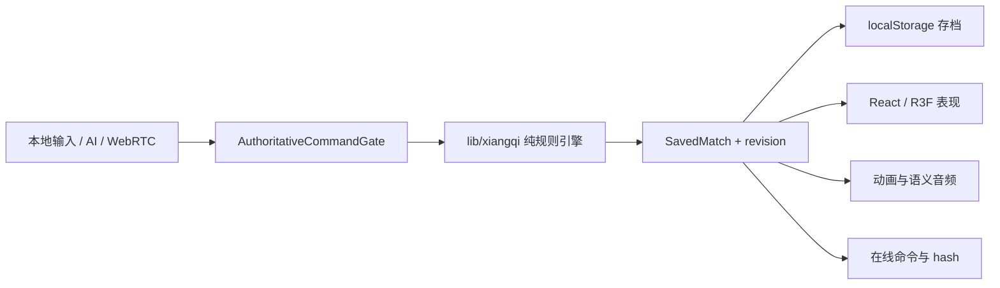

# 架构说明

本文给贡献者一张代码地图，重点记录不能被 UI、动画或网络副作用破坏的边界。具体玩法、部署和验证证据分别见根目录 `README.md`、`docs/deployment.md` 与 `docs/validation.md`。

## 核心数据流

`lib/xiangqi` 的规则状态是唯一真相。任何动画、音频、Worker、WASM、WebRTC 或 React 状态都只能消费已提交结果，不能直接修改棋局。每条命令携带 `expectedRevision`；异步结果还必须匹配当前 match、generation 和 position identity。

## 目录边界

| 目录                                                       | 职责                                        | 约束                               |
| ---------------------------------------------------------- | ------------------------------------------- | ---------------------------------- |
| `lib/xiangqi/`                                             | 规则、序列化、hash、AI 协议与确定性搜索     | 不依赖 React、Three.js 或浏览器 UI |
| `components/xiangqi/game/`                                 | 对局配置、命令门、存档策略与组件支持        | 通过规则引擎提交，不复制走法规则   |
| `components/xiangqi/ai/`                                   | Worker Provider、Master 适配与生命周期协调  | 可失败/降级，但不能提交过期着法    |
| `components/xiangqi/online/`                               | 手动信令、DataChannel、恢复与重开协议       | 只交换版本化命令和可验证状态       |
| `components/xiangqi/presentation/`、`animation/`、`audio/` | 表现时间线和音频反馈                        | 失败后棋盘仍与规则状态一致         |
| `components/xiangqi/scene/`、`pieces/`、`runtime/`、`vfx/` | R3F 场景、资产、性能和降级                  | 不参与规则判定；资源必须可释放     |
| `app/`、`worker/`                                          | Vinext 页面、客户端边界与 Cloudflare Worker | 保持安全头、MIME 和缓存合同        |
| `scripts/`                                                 | 资产、供应链、元数据和预算校验              | 校验失败必须返回非零状态           |

## 运行时边界

- 首屏只加载本机对局需要的代码。Master、轻量 AI Provider、在线会话和二维码库通过动态 import 按需加载；`npm run test:bundle` 校验 manifest 与 raw/gzip 上限。
- Easy/Normal/Hard 搜索在 Dedicated Worker 中执行；Master 使用版本化 Fairy-Stockfish WASM/NNUE，并在能力或完整性校验失败时显式降级。
- 在线模式没有权威服务端。双方对序号、revision、规范 hash 和合法着法独立验证，分叉时保持锁定。
- 3D 资产按 LOD 与画质加载。缓存源资产和实例克隆的生命周期分开，卸载时必须释放实例独占资源。

## 修改入口

- 新规则或修正规则：从 `lib/xiangqi/engine.ts` 和 `tests/unit/xiangqi/` 开始。
- 对局策略或存档：从 `components/xiangqi/game/` 与 `tests/unit/game/` 开始。
- AI：同时检查协议、Provider、Coordinator、Worker 和 `tests/unit/ai/`。
- 在线协议：同时更新协议文档、单元测试和双浏览器 E2E。
- 场景或资产：遵守 `ASSET_ATTRIBUTION.md`，更新来源、运行时产物、预算和视觉证据。

跨边界改动应在 PR 中说明保持了哪些不变量、增加了哪些失败路径测试，以及是否改变首屏下载或发布要求。
