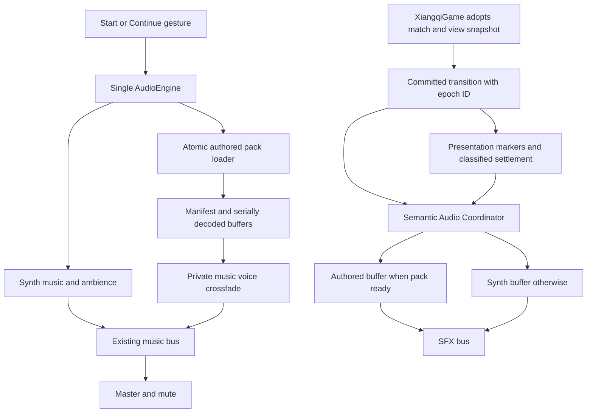
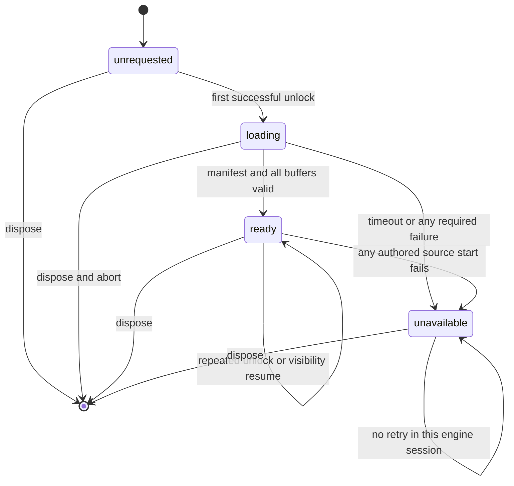
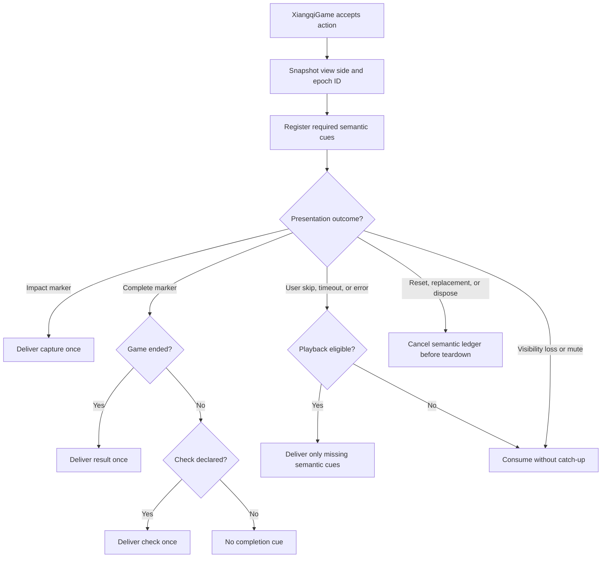
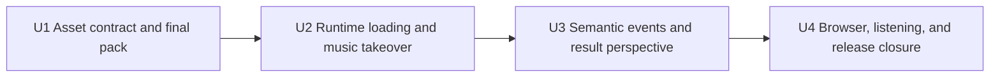

# Qin Diorama Original Music Pack - Plan

## Goal Capsule

- **Objective:** Players hear a recognizable Qin-terracotta musical identity and clear emotional punctuation at captures, checks, and game results without audio ever delaying or breaking play.
- **Means:** Deliver one versioned authored pack through the existing Web Audio graph, keep complete synthesized equivalents, and coordinate semantic cues independently from visual success (KTD1–KTD10).
- **Product authority:** The Product Contract owns audible behavior and scope. The Planning Contract owns delivery mechanics. The rules engine and committed `GameState` remain authoritative over both.
- **Execution profile:** Standard code-and-asset implementation with four dependency-ordered units.
- **Stop conditions:** Do not substitute untracked media, waive real-browser decode, or remove the synthesized fallback to finish the feature.
- **Tail ownership:** U4 owns cross-browser, listening, transfer, lifecycle, and cleanup closure after U1–U3 land.
- **Open blockers:** None.

---

## Product Contract

### Summary

Extend the existing application-wide audio engine with a compact original Qin-diorama pack, non-blocking authored-to-synth fallback, and match-scoped semantic cues. Preserve the current combat sound layer while adding material accents and outcome-aware musical punctuation.

### Problem Frame

The current soundtrack is an original eight-second synthesized pentatonic loop. It is lightweight and rights-clear, but it does not match the distinctive Qin-terracotta diorama as strongly as the visual assets and exposes a short repetition cycle during play.

The game already provides immediate role sounds, optional character speech, and system cues. Adding richer music without a narrow event policy would increase masking and fatigue, so this work must improve identity and key moments without making the score react to every move.

### Key Decisions

- **Prioritize musical identity and key moments over a full fatigue-mode redesign.** (session-settled: user-directed — chosen over equal first-version investment in identity, key moments, and fatigue controls: identity and key moments are required while broader fatigue work may follow.) Governs R1, R2, R4–R6.
- **Use one capture accent without changing the background score.** (session-settled: user-directed — chosen over important-piece-only accents, temporary music-layer changes, and leaving capture entirely to existing SFX: every capture should gain material character without making the score restless.) Governs R4.
- **Distinguish three result outcomes.** (session-settled: user-directed — chosen over five rule-reason-specific endings and one universal ending: victory, defeat, and draw provide useful emotional clarity at bounded content cost.) Governs R6.
- **Prefer a compact original music pack with synthesized fallback.** (session-settled: user-directed — chosen over pure runtime synthesis and offline-rendered project synthesis: authored audio offers the clearest quality gain while the existing synth protects reliability.) Governs R7, R9, R10.
- **Let the terminal result replace a concurrent check cue.** A finished game needs one clear musical endpoint rather than stacked system punctuation. Governs R5, R6.
- **Use the selected board-view side as the result perspective.** (session-settled: user-approved — chosen over fixed-red semantics, a new player-side setting, and a neutral-only ending: the existing red/black view control already expresses the listener's perspective.) Governs R6.
- **Keep the new capture accent in addition to the role impact sound.** (session-settled: user-approved — chosen over replacing the combat cue: the material accent adds world identity while the role sound retains attack readability.) Governs R4.
- **Preserve key semantic cues when visuals settle early, but never replay cues missed while muted or hidden.** (session-settled: user-approved — chosen over marker-only delivery and delayed catch-up: capture, check, and result meaning survives visual failure without surprising later playback.) Governs R4–R8.

### Requirements

**Musical identity**

- R1. The original score must evoke a warm miniature Qin-terracotta procession through clay-like resonance, muted bronze color, breath, and restrained ceremonial percussion rather than cinematic orchestral spectacle.
- R2. The background score must avoid the audible discontinuity and mechanical short-cycle repetition of the current eight-second loop during a fifteen-minute listening review.
- R3. Player-facing copy and asset records must describe the music as Qin-inspired visual fantasy and must not claim historical reconstruction or acoustic authenticity.

**Game-event behavior**

- R4. During a normal eligible presentation, every committed capture must add exactly one short clay-or-bronze accent at impact while the existing role impact sound remains and the background-music state does not change. Eligible user skip, timeout, or presentation error must compensate a missing accent once; mute or visibility loss consumes it without playback or catch-up.
- R5. During a normal eligible presentation, a non-terminal check must play one concise check cue at completion while the background score continues without a section change. Eligible user skip, timeout, or presentation error must compensate a missing cue once; mute or visibility loss consumes it without playback or catch-up.
- R6. During a normal eligible presentation, a finished game must play exactly one resolution at completion: victory when the winner matches the board-view side captured for that action, defeat when the other side wins, or draw when no winner exists. Eligible user skip, timeout, or presentation error must compensate a missing result once; mute or visibility loss consumes it without playback or catch-up.

**Delivery and resilience**

- R7. The original pack must load as an optional enhancement after the audio-unlock gesture, and any manifest, network, decode, or start failure must leave gameplay running with the complete synthesized soundtrack.
- R8. Music and event cues must respect the existing music, SFX, master, mute, and foreground lifecycle; a semantic cue consumed while muted or hidden must not play later.
- R9. Critical first-play audio must remain at or below 1.5 MiB and the complete delayed runtime audio package must remain at or below 8 MiB without delaying the playable game. The decoded authored pack must remain at or below 30 MiB, and the engine-owned decoded working set including synthesized buffers and an active crossfade must remain at or below 40 MiB.
- R10. Every delivered audio file must have an editable or lossless source, an optimized web output, authorship or authorization evidence, and a source record suitable for repository review.

**Quality assurance**

- R11. Release verification must cover successful playback, synthesized fallback, loop continuity, event-cue intelligibility, match-scoped deduplication, visibility changes, mute behavior, and cleanup after repeated games.

### Key Flows

- F1. Start with preferred music
  - **Trigger:** The player starts or continues a game with audio enabled.
  - **Steps:** Audio unlocks from the user gesture, the synthesized bed starts immediately, and the complete original pack becomes eligible to take over at a musical boundary when ready.
  - **Outcome:** The player hears the preferred score without waiting to play.
  - **Covered by:** R1, R7–R9.

- F2. Continue through an audio-asset failure
  - **Trigger:** The original pack cannot be fetched, validated, decoded, or started.
  - **Steps:** The enhancement becomes unavailable for the current engine session and every logical cue continues through its synthesized equivalent.
  - **Outcome:** The board remains interactive and the rules state is unchanged.
  - **Covered by:** R7, R8, R11.

- F3. Resolve capture and check feedback
  - **Trigger:** A committed move captures a piece, declares check, or does both.
  - **Steps:** The capture accent plays at impact; a non-terminal check cue plays at completion; the background score does not change state.
  - **Outcome:** Both events remain legible without turning the music into per-move scoring.
  - **Covered by:** R4, R5, R8.

- F4. Resolve the game
  - **Trigger:** The authoritative game state becomes ended.
  - **Steps:** The action's captured board-view side selects victory or defeat, no winner selects draw, and the result suppresses a concurrent check cue.
  - **Outcome:** The match receives one clear musical conclusion.
  - **Covered by:** R6, R8.

- F5. Settle an interrupted presentation
  - **Trigger:** A committed action is explicitly skipped by the player, times out, ends with a presentation error, becomes hidden, or is cancelled by match replacement or disposal before its semantic marker fires.
  - **Steps:** User skip, timeout, and presentation error deliver missing capture, check, or result cues once when playback is eligible; mute or visibility loss consumes them without catch-up; match reset, game replacement, and disposal cancel them without playback. Role, voice, and VFX markers are never flushed.
  - **Outcome:** Game meaning remains audible without replay storms or delayed surprises.
  - **Covered by:** R4–R8, R11.

### Acceptance Examples

- AE1. Preferred soundtrack becomes available
  - **Covers:** R1, R7–R9.
  - **Given:** The player starts a game and every original-pack asset is valid.
  - **When:** The pack becomes ready after audio unlock.
  - **Then:** It takes over at the next synthesized-loop boundary without delaying the first move or producing an abrupt transition.

- AE2. Preferred soundtrack fails
  - **Covers:** R7, R8, R11.
  - **Given:** The player has started the game and one pack resource cannot be used.
  - **When:** Loading, validation, decoding, or background-source startup fails.
  - **Then:** The pack becomes unavailable for that engine session and both players continue with synthesized music and cues.

- AE3. A capture gives check
  - **Covers:** R4, R5.
  - **Given:** A legal move captures a piece and leaves the opposing general in check without ending the game.
  - **When:** The presentation reaches impact and completion, or settles early while audio is eligible.
  - **Then:** One additional material capture accent and one check cue play while the background score continues unchanged.

- AE4. A move ends the game with check
  - **Covers:** R5, R6.
  - **Given:** A legal move produces an ended game state, also declares check, and the action captured the red board-view side.
  - **When:** Red wins, black wins, or the position is drawn.
  - **Then:** Exactly one victory, defeat, or draw resolution plays and no check cue plays.

- AE5. Audio is muted or the page is hidden
  - **Covers:** R8, R11.
  - **Given:** The original pack is ready or playing.
  - **When:** The player mutes audio or the document moves to the background during an action.
  - **Then:** Playback follows the existing mute or visibility behavior, no transient cue catches up later, and music sources are not duplicated on return.

- AE6. A second local match starts
  - **Covers:** R11.
  - **Given:** One match has already used revision-based action IDs.
  - **When:** The players restart or continue another match in the same page session.
  - **Then:** The new match's first presentation and semantic cues are not suppressed as duplicates from the previous match.

### Success Criteria

- A blind listening review describes the score with at least two intended material cues such as clay, bronze, breath, or miniature procession and does not classify it as a generic cinematic battle theme.
- A fifteen-minute continuous review finds no audible loop break, eight-second-style mechanical repetition, or persistent masking of move and system feedback.
- Capture, check, victory, defeat, and draw cues remain distinguishable at default mix levels on desktop and a modern phone.
- Network, decode, playback, visibility, and presentation failures never change the committed game state or prevent the next legal command.
- Audio transfer, decoded-memory, provenance, lifecycle, and cleanup checks pass the limits owned by R9–R11.

### Scope Boundaries

#### Deferred for later

- Full adaptive stems or broad music-state changes for opening, tension, and endgame phases.
- A dedicated Focus or Low Stimulation audio profile beyond the existing bus controls.
- Separate musical resolutions for checkmate, resignation, stalemate, repetition, and the no-capture rule.
- A wider redesign of role movement, attack, impact, fracture, or character-voice audio.

#### Deferred to Follow-Up Work

- A global cross-cue voice governor, ducking policy, or new voice-stealing system beyond the existing per-cue limit.
- A second runtime codec candidate unless the required Chrome, Firefox, Safari, and iOS matrix disproves the v1 MP3/WAV baseline.
- General presentation-timeline refactoring beyond match-scoped action identity and semantic-audio settlement.

#### Outside this product's identity

- Claims that the soundtrack reconstructs authentic Qin-period music.
- A continuous epic battle score that competes with board readability and long-form strategic play.

### Dependencies and Assumptions

- The music pack will be produced internally or commissioned with rights that allow editable or lossless source retention and web-game redistribution.
- The existing rules and presentation events remain the source for capture, non-terminal check, and ended-game signals.
- The existing red/black board-view control becomes the explicit result perspective; no persistent player identity is introduced.
- Quality approval uses documented listening review alongside automated delivery and lifecycle checks.

### Sources and Research

- `components/xiangqi/audio/AudioEngine.ts` — synthesized buffers, buses, one-context lifecycle, visibility handling, and source cleanup.
- `components/xiangqi/audio/presentation-audio.ts` — existing role markers and current check/result ordering.
- `components/xiangqi/presentation/PresentationStore.ts` and `components/xiangqi/animation/TimelineDirector.ts` — markers, skip behavior, timeout settlement, and cross-match duplicate risk.
- `app/BoardViewer.tsx` — explicit red/black board-view state used by R6.
- `lib/xiangqi/types.ts` and `lib/xiangqi/engine.ts` — authoritative capture, check, terminal events, winner/draw state, and revision-scoped event IDs.
- `assets/audio/SOURCES.md` — current synthesis-only rights record that U1 replaces with a mixed synth/authored ledger.
- `docs/qin-diorama-art-direction.md` — terracotta-diorama visual identity and asset-source policy.
- `docs/ideation/2026-08-26-qin-diorama-background-music-ideation.html` — ranked direction, external grounding, and rejected alternatives.
- [MDN: Web Audio best practices](https://developer.mozilla.org/en-US/docs/Web/API/Web_Audio_API/Best_practices), [decodeAudioData](https://developer.mozilla.org/en-US/docs/Web/API/BaseAudioContext/decodeAudioData), and [AudioBufferSourceNode](https://developer.mozilla.org/en-US/docs/Web/API/AudioBufferSourceNode) — user activation, complete-file decode, reusable buffers, and one-shot source semantics.
- [W3C Web Audio](https://www.w3.org/TR/webaudio/) and [Page Visibility](https://www.w3.org/TR/page-visibility-2/) — scheduled audio automation and foreground lifecycle.
- [Vite static assets](https://vite.dev/guide/assets) and [Playwright network mocking](https://playwright.dev/docs/network) — versioned public URLs and deterministic browser failure coverage.
- [The Met: Music and Art of China](https://www.metmuseum.org/essays/music-and-art-of-china) and [Smithsonian: Resound](https://asia-archive.si.edu/exhibition/resound-ancient-bells-of-china/) — instrument-family references and historical-claim boundaries.

---

## Planning Contract

### Key Technical Decisions

- KTD1. **Treat the authored pack as one readiness transaction.** (session-settled: user-approved — chosen over mixing a partially available authored pack with synth cues: one sound identity and one fallback state are easier to reason about.) The runtime uses `unrequested`, `loading`, `ready`, or `unavailable`; a 30-second project-level deadline, any required-resource failure, or any authored source-start failure makes the pack unavailable for that `AudioEngine` session. The failing event immediately uses its matching synth cue, and an authored music voice transitions back to synth without blocking the game. Governs R7, R11.
- KTD2. **Ship a versioned MP3/WAV baseline with executable loop metadata.** The v1 pack contains one 72-second stereo MP3 background loop and five short PCM16 WAV transients for capture, check, victory, defeat, and draw. The manifest marks the background track as the critical group and all event cues as deferred. A source becomes eligible for `ready` only when its decoded duration contains the audited loop range; the runtime must assign the manifest values to `AudioBufferSourceNode.loopStart` and `loopEnd` before starting the authored background voice. Governs R2, R4–R6, R9.
- KTD3. **Load after unlock without joining the start promise and with bounded concurrency.** The existing synth music and ambience start inside the user gesture. Pack fetch and decode run as a detached enhancement with an engine-owned abort controller, generation token, and injected fetch/decode seams for tests. After the manifest, the critical background and then each deferred cue are fetched and decoded in a fixed order with at most one fetch and one decode in flight; the encoded body reference is released before the next asset. Governs R7–R9.
- KTD4. **Crossfade through private music gains.** The synth loop and authored loop each own a gain node that feeds the unchanged `music` bus. A ready pack applies the audited loop range and schedules a one-second crossfade at the next known eight-second synth boundary; the old source stops after the fade. Governs R2, R7, R8.
- KTD5. **Resolve every logical pack cue to authored or synth at play time.** The engine uses decoded authored buffers only when the full pack is ready and otherwise creates the existing synth buffer; new synthesized capture and draw cues make the fallback complete. A failed authored transient start plays the synth equivalent once, atomically invalidates the pack, and initiates music fallback if necessary. Governs R4–R7.
- KTD6. **Coordinate semantic audio separately from role markers and classify settlement causes.** (session-settled: user-approved — chosen over marker-only delivery and flushing the full visual timeline: authoritative capture, check, and result cues need settlement guarantees while role, voice, and VFX cues do not.) A coordinator records required and fired semantic cues by match-scoped action ID, uses impact and complete markers for normal timing, and receives an explicit settlement cause. User skip, timeout, and presentation error compensate missing cues; visibility loss or mute consumes them; match reset, game replacement, and disposal cancel the ledger before presentation teardown. Governs R4–R8, R11.
- KTD7. **Keep the capture accent additive.** (session-settled: user-approved — chosen over replacing the role impact sound: material identity and attack readability stay separate.) Only the semantic capture cue is counted against R4; existing role impact, fracture, and optional voice behavior remain unchanged. Governs R4.
- KTD8. **Snapshot the controlled board-view side for each accepted action.** (session-settled: user-approved — chosen over fixed-red interpretation and a new persistent player-side setting: the existing view control supplies the required perspective.) `XiangqiGame` owns the current view side, passes it to the board viewer, and gives the accepted action's side to semantic result selection. Governs R6.
- KTD9. **Scope presentation identity to a page-local match epoch.** Prefix the presentation and semantic-ledger action ID as `${matchEpoch}:${domainEventId}` while leaving rule revision, domain event IDs, and serialized game state unchanged. Advance the monotonic epoch only after a new or resumable game snapshot is actually adopted, not on a button click; an already-ended Continue neither begins a semantic action nor replays its result. Governs R11.
- KTD10. **Route by semantic bus and suppress ineligible transients.** Background music stays on `music`; authored and synthesized capture, check, and result cues use `sfx`; UI confirmation remains on `ui`. A transient is eligible only when the engine is unlocked, unmuted, visible, running, and not disposed. A visibility event synchronously closes foreground eligibility before any asynchronous context suspension or presentation settlement, and visibility return reopens it only after the context is running. Governs R8, R11.

### High-Level Technical Design

The implementation extends the current audio boundary. It does not add audio state to the rule engine or make presentation completion depend on media work.



The authored pack has one terminal failure state per engine session. A refresh creates a new engine and may try again.



Semantic cue selection uses authoritative events but follows presentation timing when that timing succeeds.



### Output Structure

```text
assets/audio/
  SOURCES.md
  qin-diorama/v1/
    SOURCES.md
    source/
public/audio/qin-diorama/v1/
  manifest.json
  qin-procession-v1.mp3
  capture-clay-v1.wav
  check-bronze-v1.wav
  result-victory-v1.wav
  result-defeat-v1.wav
  result-draw-v1.wav
components/xiangqi/audio/
  qin-audio-pack-contract.ts
  qin-audio-pack.ts
  SemanticAudioDirector.ts
scripts/
  verify-audio-assets.mjs
tests/unit/presentation/
  audio-pack-contract.test.ts
  semantic-audio.test.ts
docs/audio/
  qin-diorama-audio-qa.md
```

### Implementation Constraints

- Do not add a second `AudioContext`, an audio framework, WebCodecs, or a service dependency.
- Use `import.meta.env.BASE_URL` with versioned public paths so non-root Vite deployments and static caching do not reuse stale media.
- Decode complete files with the existing context; process runtime media in the manifest-defined order with at most one fetch and one decode in flight, and drop each encoded `ArrayBuffer` reference before advancing.
- Keep marker names, marker times, `DomainEvent`, `GameState`, and the rule command path unchanged.
- Abort pending fetches on dispose and guard every post-decode continuation with the active generation because `decodeAudioData()` cannot be aborted.
- Muting does not cancel package loading. Hidden readiness does not start the authored loop until the context is visible and running, and foreground eligibility changes before presentation settlement can observe the visibility event.
- Final hashes, encoded bytes, loop markers, and gain trim are implementation-time asset facts that U1 records in the manifest.

### System-Wide Impact

- **Players:** Audio quality improves without changing move latency, save behavior, or rule outcomes. The selected board view gains a defined role in result audio.
- **Asset contributors:** Audio joins character assets as a source-controlled, versioned, rights-audited deliverable with lossless masters in Git LFS.
- **Runtime:** A 72-second stereo buffer costs about 24.2 MiB at 44.1 kHz or 26.4 MiB at 48 kHz before the five transients. R9 therefore limits authored decoded bytes to 30 MiB and the reachable engine-owned decoded working set to 40 MiB; serial loading bounds encoded media to one asset body at a time. Engine-owned references are cleared on dispose, without claiming control of browser garbage collection.
- **Deployment:** Static hosting must serve versioned MP3 and WAV files with matching MIME types and must not rewrite them to HTML fallbacks.
- **QA:** Automated tests prove state, routing, failure isolation, and cleanup. Human listening proves musical identity, loop continuity, and mix intelligibility.

### Risks and Mitigations

| Risk                                                | Impact                                       | Mitigation                                                                                                          |
| --------------------------------------------------- | -------------------------------------------- | ------------------------------------------------------------------------------------------------------------------- |
| Authored masters or rights evidence are incomplete  | R10 cannot ship                              | U1 treats provenance and editable or lossless source as a release gate, not follow-up documentation.                |
| Lossy encoder padding creates a loop seam           | R2 fails on one browser                      | Record audited loop markers, keep the loop long, and require desktop Safari plus real iOS listening before release. |
| A late decode completes after unmount               | A stale source can start or buffers can leak | KTD3 uses abort plus generation checks before every state change and source start.                                  |
| Presentation settles before semantic markers        | Required cues disappear                      | KTD6 owns only semantic cue compensation and never flushes role, voice, or VFX markers.                             |
| Revision IDs repeat after Restart                   | New-match audio or animation is suppressed   | KTD9 scopes presentation IDs to a monotonic page-local match epoch.                                                 |
| Visibility settlement races context suspension      | A hidden cue can leak or replay              | KTD10 closes eligibility synchronously on the visibility event and reopens it only after a successful resume.       |
| Decoded audio and transient response bodies overlap | Mobile memory spikes during the first match  | KTD3 serializes fetch/decode, U2 reports decoded bytes, and R9 imposes authored and engine working-set ceilings.    |
| Authored cues mask role impact or voice             | Tactical feedback becomes tiring             | U1 keeps transients restrained; U4 reviews default mix on headphones and phone speakers.                            |

### Dependency Order



---

## Implementation Units

### U1. Author and validate the Qin-diorama audio pack

- **Goal:** Deliver the final source, runtime media, manifest contract, provenance record, and automated static gates for the v1 pack.
- **Requirements:** R1–R6, R9, R10; Success Criteria for identity, repetition, intelligibility, and provenance.
- **Dependencies:** None.
- **Files:**
  - `.gitattributes`
  - `assets/audio/SOURCES.md`
  - `assets/audio/qin-diorama/v1/SOURCES.md`
  - `assets/audio/qin-diorama/v1/source/`
  - `public/audio/qin-diorama/v1/manifest.json`
  - `public/audio/qin-diorama/v1/qin-procession-v1.mp3`
  - `public/audio/qin-diorama/v1/capture-clay-v1.wav`
  - `public/audio/qin-diorama/v1/check-bronze-v1.wav`
  - `public/audio/qin-diorama/v1/result-victory-v1.wav`
  - `public/audio/qin-diorama/v1/result-defeat-v1.wav`
  - `public/audio/qin-diorama/v1/result-draw-v1.wav`
  - `components/xiangqi/audio/qin-audio-pack-contract.ts`
  - `scripts/verify-audio-assets.mjs`
  - `tests/unit/presentation/audio-pack-contract.test.ts`
  - `package.json`
- **Approach:**
  1. Produce a 72-second loop with at least four distinct phrases and the material vocabulary owned by R1; target approximately -18 LUFS integrated and no higher than -1 dBTP as project mastering targets.
  2. Produce five concise, wordless event cues. Keep the capture accent below 0.5 seconds, check below 0.9 seconds, and each result below 2.5 seconds.
  3. Export the background as a versioned stereo MP3 whose selected critical group, including the manifest, stays within R9. Export short event transients as PCM16 WAV to retain precise attacks.
  4. Store lossless masters and editable stems or session exports under the source directory and add the relevant lossless/project extensions to Git LFS.
  5. Define a versioned manifest with logical ID, deterministic load order, load group, URL, MIME, codec, bytes, SHA-256, duration, channels, sample rate, loop markers, bus, and synth fallback ID.
  6. Validate allowed IDs, unique paths, versioned names, hashes, loop-marker bounds, source records, MIME declarations, and all R9 encoded and decoded budgets with a Node script. Static transfer accounting is the manifest file itself plus each unique runtime media file once, using disk bytes.
- **Execution note:** Asset approval precedes runtime integration; do not use temporary music or unlicensed reference downloads to satisfy this unit.
- **Patterns to follow:** `public/models/pieces/v1/manifest.json`, `scripts/assets/validate-pieces.mjs`, `.gitattributes`, and the asset-source policy in `docs/qin-diorama-art-direction.md`.
- **Test scenarios:**
  - Covers AE1. A valid manifest and all six runtime files pass schema, hash, path, MIME, and budget checks.
  - A duplicate logical ID, missing fallback ID, or unknown bus fails manifest validation with the offending asset identified.
  - A changed media file fails SHA-256 validation until its reviewed manifest entry is updated.
  - A loop end beyond decoded duration or before loop start fails the contract test.
  - A critical group above 1.5 MiB or complete package above 8 MiB fails the budget script.
  - An authored decoded-byte estimate above 30 MiB fails validation; the report lists `channels × sampleFrames × 4` for each asset and the total.
  - The source ledger rejects an authored runtime file that lacks an author, authorization, source path, or Qin-inspired claim boundary.
- **Verification:** The final files, source ledger, and manifest agree; the validation script reports both budget totals; an asset reviewer approves the identity and source evidence before U2 begins.

### U2. Add atomic pack loading and background-music takeover

- **Goal:** Load and decode the complete authored pack after unlock, use synth audio during every failure path, and crossfade the preferred background loop inside the existing graph.
- **Requirements:** R2, R7–R9, R11; F1, F2; AE1, AE2, AE5.
- **Dependencies:** U1.
- **Files:**
  - `components/xiangqi/audio/AudioEngine.ts`
  - `components/xiangqi/audio/audio-types.ts`
  - `components/xiangqi/audio/qin-audio-pack.ts`
  - `tests/unit/presentation/audio-engine.test.ts`
  - `tests/unit/presentation/audio-pack-contract.test.ts`
- **Approach:**
  1. Extend the injectable Web Audio contract with Promise-based decode, `loopStart` and `loopEnd` on `BufferSourceLike`, and injected fetch/time controls needed for deterministic tests.
  2. Start the existing synthesized music and ambience before launching the detached pack loader from the first successful unlock.
  3. Fetch and validate the manifest, then fetch/validate/decode the critical background followed by each deferred cue in manifest order. Keep at most one fetch and one decode in flight, drop the encoded body after each decode, and publish `ready` only after the final buffer succeeds.
  4. Enforce KTD1 with one abort controller, one 30-second deadline, one generation token, and no retry after `unavailable` in the same engine session. Clear partial decoded buffers atomically on failure.
  5. Replace anonymous permanent music loops with owned source-and-gain handles while leaving the shared `music` bus responsible only for user volume.
  6. Validate decoded loop bounds, set `loop`, `loopStart`, and `loopEnd` before `start()`, then schedule KTD4 from the recorded synth start time. Stop and disconnect the old source after the fade and leave synth untouched until authored startup succeeds.
  7. Mark foreground playback ineligible synchronously on `visibilitychange`, before any asynchronous context suspension or presentation skip, and reopen eligibility only after resume reaches `running`; serialize resume against close.
  8. Clear pending loads, decoded buffers, music handles, scheduled transitions, listeners, and nodes during dispose; stale decode completions must observe the generation and release their results without state mutation.
  9. Expand `debugSnapshot()` with pack state, generation, current music mode, authored and total decoded bytes, active sources by kind, pending fetch/decode counts, abort count, source start/stop/end counts, and listener attachment for tests and diagnostics.
- **Execution note:** Add characterization tests for the current one-context, bus, visibility, and disposal behavior before changing the loop ownership model.
- **Patterns to follow:** Constructor injection and fake Web Audio nodes in `tests/unit/presentation/audio-engine.test.ts`; best-effort source cleanup and single-listener lifecycle in `AudioEngine.ts`.
- **Test scenarios:**
  - Covers AE1. Unlock starts one synth music source immediately, does not await media fetch, and swaps to one authored source at the next eight-second boundary after the full pack becomes ready.
  - Covers AE2. Manifest request rejection, non-success HTTP response, body failure, corrupt bytes, decode rejection, and deadline expiry each leave synth music active and set the pack to `unavailable`.
  - Repeated unlock after `ready` or `unavailable` creates no second context, no duplicate loader, and no duplicate background source.
  - A late decode that resolves after dispose cannot mutate state, cache a buffer, or start a source.
  - Authored readiness while hidden records `ready` but creates no authored source until a successful visible resume.
  - Muting during load keeps master output at zero; unmuting does not recreate the loader or background sources.
  - A scheduled crossfade applies opposing private gain ramps, stops the synth after the fade, and retains the user `music` bus value.
  - The authored voice receives validated `loopStart` and `loopEnd` before start; missing, reversed, or out-of-duration markers prevent `ready`.
  - Background source startup failure leaves the synth source running and moves the pack to `unavailable`. A later authored transient startup failure plays that event's synth equivalent once, invalidates the complete pack, and returns music to synth.
  - Loader probes never exceed `maxInFlightFetches = 1` or `maxInFlightDecodes = 1`; authored decoded bytes remain at or below 30 MiB and the engine-owned decoded working set, including a crossfade, remains at or below 40 MiB.
  - One hundred unlock, visibility, cue, and dispose cycles settle all controlled promises and `ended` callbacks, then leave engine-owned references, active sources, pending operations, buses, listeners, and decoded buffers at their declared zero or steady-state counts with no late start. The test does not infer browser garbage collection or native-memory release.
- **Verification:** The engine exposes one context, one current background voice, bounded serial loading, a bounded decoded cache, and deterministic pack state; every media failure is contained inside audio and leaves the game start promise usable.

### U3. Coordinate semantic cues, board-view results, and match identity

- **Goal:** Deliver capture, non-terminal check, and victory/defeat/draw cues exactly once across normal and early-settle presentations without duplicating events between matches.
- **Requirements:** R4–R8, R11; F3–F5; AE3–AE6.
- **Dependencies:** U2.
- **Files:**
  - `app/BoardViewer.tsx`
  - `components/xiangqi/XiangqiGame.tsx`
  - `components/xiangqi/audio/audio-types.ts`
  - `components/xiangqi/audio/AudioEngine.ts`
  - `components/xiangqi/audio/presentation-audio.ts`
  - `components/xiangqi/audio/SemanticAudioDirector.ts`
  - `tests/unit/presentation/semantic-audio.test.ts`
  - `tests/unit/presentation/audio-engine.test.ts`
  - `tests/unit/presentation/store.test.ts`
- **Approach:**
  1. Make board-view side controlled by `XiangqiGame`, preserve red as the initial view, and snapshot the current side when a legal command becomes a presentation action.
  2. Add a page-local match epoch owned by `XiangqiGame`. Advance it only when a new, restarted, or resumable game is adopted, then prefix both presentation and semantic-ledger action IDs without modifying domain event IDs or serialized game state.
  3. Split existing role marker playback from a semantic director with explicit `begin`, marker delivery, and `settle(cause)` operations that derive required capture, check, and result cues only from the committed transition.
  4. Fire capture at impact and select terminal-before-check at complete; map winner against the action's view-side snapshot and map no winner to draw.
  5. Replace the presentation layer's shared `skipped` interpretation with classified causes: `user-skip`, `timeout`, `presentation-error`, `visibility-hidden`, `match-reset`, `game-replaced`, and `dispose`. Only the first three compensate missing cues in capture-then-terminal/check order and only when KTD10 says playback is eligible.
  6. Consume muted or visibility-hidden semantic cues without later replay. On match reset, game replacement, or dispose, cancel pending semantic state before asking presentation to settle so teardown cannot trigger compensation.
  7. Keep the existing role impact and voice behavior; route the new material accent and system cues through `sfx` and use authored buffers only when KTD1 is `ready`. If an authored cue cannot start, play its synth equivalent once and notify the engine to invalidate the pack under KTD1.
- **Execution note:** Implement the event-selection and deduplication rules as pure tests before wiring React and presentation callbacks.
- **Patterns to follow:** `GameActionTransition` as a rule-to-presentation snapshot, existing `presentation.subscribeCue`, `eventId`-based domain ordering, and `GameSettings` bus ownership.
- **Test scenarios:**
  - Covers AE3. A capture that gives non-terminal check emits one role impact, one material accent at impact, and one check cue at completion without changing the music mode.
  - Covers AE4. A terminal move that also declares check emits one result and no check; red/black winners map against both red and black view snapshots, and no winner maps to draw.
  - Covers F5. Skipping before impact emits the missing capture and terminal/check semantic cues once but does not emit fracture, voice, or other visual markers.
  - Timeout or presentation error after impact emits only the missing completion cue and cannot repeat the capture accent.
  - Muting or hiding before early settlement consumes the missing cues and unmute or visibility return produces no catch-up.
  - Listener-order permutations around `visibilitychange` cannot deliver a transient after foreground eligibility closes, and eligibility stays closed until the resumed context is `running`.
  - Repeated marker callbacks, repeated settlement, or React subscription reattachment cannot play the same semantic cue twice.
  - Covers AE6. The first move of two consecutive adopted matches uses distinct `${matchEpoch}:${domainEventId}` IDs and both matches produce their expected presentation and audio cues; a failed button action does not advance the epoch.
  - Undo does not replay the undone capture/check/result cues; Restart and game replacement cancel pending semantic state before presentation skip; Continue of an already-ended save does not call `begin` or replay its historical result.
  - An authored cue start failure immediately uses the matching synth cue, moves the pack to `unavailable`, and does not reject the visual timeline.
- **Verification:** Every authoritative transition has a deterministic semantic cue plan, terminal priority is enforced, result perspective is testable, and no cue path can await or alter rule dispatch.

### U4. Close browser, listening, transfer, and resilience validation

- **Goal:** Prove the final pack and runtime behavior on real browsers and devices, document the listening evidence, and close performance and cleanup gates.
- **Requirements:** R1–R11; F1–F5; AE1–AE6; all Success Criteria.
- **Dependencies:** U2, U3.
- **Files:**
  - `components/xiangqi/runtime/test-faults.ts`
  - `tests/e2e/audio.spec.ts`
  - `tests/e2e/resilience.spec.ts`
  - `tests/e2e/performance.spec.ts`
  - `docs/audio/qin-diorama-audio-qa.md`
  - `scripts/verify-audio-assets.mjs`
  - `package.json`
- **Approach:**
  1. Extend the existing audio probe to count contexts, unique pack requests, pending and peak fetch/decode work, decoded bytes, source starts/stops/ends by kind, gain ramps, aborts, generation, listener attachment, and final engine-owned cleanup without exposing production internals beyond a bounded debug snapshot.
  2. Add deterministic network abort, non-success response, corrupt-media, slow-decode, and late-completion cases while asserting legal board revisions continue.
  3. Define static transfer as the manifest plus each unique successful runtime file's disk bytes once. On a cold cache, compare that list with the same unique successful response-body URLs and bytes; exclude failed, aborted, and corrupt candidates from successful-package totals while asserting each URL is attempted at most once.
  4. Run the real files through browser decode and source start on Chromium, Firefox, WebKit, and a real modern iOS Safari device; verify deployed MIME headers, cold-cache request behavior, and that a warm versioned URL does not redownload the complete pack.
  5. Audit a fifteen-minute loop, capture-heavy positions, capture-plus-check, all three outcomes, mute, background/foreground return, and phone-speaker intelligibility at the default mix.
  6. Record device/browser versions, cold/warm cache, headphones/speaker path, loop seam result, event masking result, and any accepted tuning changes in the QA document.
  7. Stress two consecutive matches and one hundred semantic cue cycles; after controlled promises and `ended` callbacks settle, verify pending operations are zero, listeners detach, stale generations cannot start sources, and engine-owned source, buffer, request, and node references return to declared stable counts. Do not interpret this as proof of browser GC.
- **Execution note:** Browser automation proves lifecycle and failure isolation; final release still requires real iOS and human listening evidence because fake contexts cannot prove codec or mix quality.
- **Patterns to follow:** Gesture-time context probe in `tests/e2e/audio.spec.ts`, optional-resource failure isolation in `tests/e2e/resilience.spec.ts`, and transfer measurement in `tests/e2e/performance.spec.ts`.
- **Test scenarios:**
  - Covers AE1. A cold-cache start requests no authored media before the gesture, starts synth immediately, loads the pack once, and transitions to authored music without blocking the first legal move.
  - Covers AE2. Network abort, non-success response, invalid bytes, and delayed decode each leave the game playable for multiple legal red and black turns with one synth background source.
  - A routed network failure is attempted once per engine session even after repeated Start, Continue, visibility, and cue actions.
  - Covers AE5. Repeated background/foreground and mute/unmute cycles do not duplicate loops, catch up transients, or resume a disposed context.
  - Covers AE6. Two full Start/Restart cycles do not suppress the second match's first action and do not grow presentation or audio ledgers without bound.
  - Static disk totals and cold-cache unique successful response totals contain the same manifest/media URLs and remain within R9; failure fixtures are accounted separately and no asset URL is retried in-session.
  - Runtime probes show one-at-a-time fetch/decode, authored decoded bytes at or below 30 MiB, and the engine-owned decoded working set at or below 40 MiB.
  - Chromium, Firefox, WebKit, and real iOS Safari decode the MP3/WAV baseline and play every authored logical cue; no unsupported second codec is added without a recorded failure.
  - A fifteen-minute listening session finds no loop click, short-cycle repetition, or persistent masking and distinguishes capture, check, victory, defeat, and draw at default levels.
- **Verification:** Automated results, transfer evidence, the completed browser matrix, and the signed listening checklist all pass; any failing platform or audible seam keeps the feature unfinished.

---

## Verification Contract

### Automated Commands

| Command                                                                    | Applies to | Required outcome                                                                                                                                                                                                 |
| -------------------------------------------------------------------------- | ---------- | ---------------------------------------------------------------------------------------------------------------------------------------------------------------------------------------------------------------- |
| `npm run assets:audio:validate`                                            | U1, U4     | Manifest, files, hashes, MIME declarations, source records, encoded transfer limits, decoded authored estimate, and loop-marker bounds pass.                                                                     |
| `npm run test:presentation`                                                | U1–U3      | Pack contract, engine state, semantic priority, settlement, match identity, and cleanup tests pass.                                                                                                              |
| `npm run typecheck`                                                        | U1–U4      | New manifest, engine, view-side, and coordinator types compile without suppression.                                                                                                                              |
| `npm run lint`                                                             | U1–U4      | Code, tests, scripts, and docs introduce no lint errors.                                                                                                                                                         |
| `npm run test:budget`                                                      | U1, U4     | Existing model/environment budgets and new audio transfer budgets pass together.                                                                                                                                 |
| `npm run test:e2e -- tests/e2e/audio.spec.ts tests/e2e/resilience.spec.ts` | U2–U4      | Gesture unlock, real decode, failure fallback, match continuity, visibility, and cleanup pass.                                                                                                                   |
| `npm run test:performance`                                                 | U4         | Existing render thresholds remain green; cold-cache unique response accounting, request/decode concurrency, and source-count probes stay within R9. This command does not claim audible quality or iOS coverage. |
| `npm run test:unit`                                                        | U4         | Xiangqi rules, game controller, and presentation regressions remain green.                                                                                                                                       |
| `npm run test:e2e`                                                         | U4         | The complete desktop and mobile browser flow remains playable with audio enabled and failed.                                                                                                                     |
| `npm run build`                                                            | U4         | The production Vite/vinext build includes versioned media and serves valid asset URLs.                                                                                                                           |

### Behavioral Gates

- No request for authored media occurs before Start or Continue unlocks audio.
- Every authored failure leaves a complete synth equivalent and never rejects rule dispatch, board interaction, or presentation settlement.
- Capture, check, result, and new-match deduplication behave the same under normal, reduced-motion, skipped, timed-out, and errored presentations.
- `debugSnapshot()` reports zero pending fetch/decode work, detached listeners, stopped engine-owned sources, no late starts, and declared loop/buffer reference counts after dispose; browser automation does not claim garbage collection or native-memory release it cannot observe.
- Authored loop sources receive validated non-default `loopStart` and `loopEnd` values before start, and every loader run observes one-fetch/one-decode concurrency.
- Static package bytes and cold-cache unique successful response bytes reconcile URL by URL; failure traffic is reported separately and does not hide retries.
- The deployed response `Content-Type` matches MP3 and WAV media, and no static request falls through to application HTML.

### Human and Device Gates

- Desktop Chrome, Firefox, and Safari pass cold/warm cache, mute, volume, background/foreground, and loop-transition review.
- A real modern iOS Safari device passes user activation, MP3/WAV decode, lock-screen/background return, and speaker intelligibility review.
- A separately recorded fifteen-minute session and capture-heavy fixture pass the identity, repetition, seam, masking, fatigue, cue-distinction, and phone-speaker checks in Success Criteria. The record names browser/device, cold or warm cache, headphones or speaker, reviewer, and result; automated performance success cannot substitute for this gate.
- The reviewer confirms every runtime file has a matching lossless/editable source and redistribution evidence.

---

## Definition of Done

### Global Completion

- All R1–R11 requirements, F1–F5 flows, and AE1–AE6 acceptance examples are satisfied with final authored media rather than placeholders.
- The game remains fully playable when the complete pack is missing, corrupt, slow, unsupported, muted, hidden, or disposed during decode.
- One application-wide `AudioContext` owns synth and authored sources; no branch adds a second context or an audio dependency.
- Two consecutive matches, early presentation settlement, and repeated visibility changes produce no lost required cue, duplicate loop, delayed catch-up, or cross-match suppression.
- Static and measured runtime bytes, 30 MiB authored decode, 40 MiB engine working-set, and serial fetch/decode gates pass R9; engine-owned source/reference counts stay stable and the real browser/device matrix is recorded.
- Source, rights, manifest, QA, and Qin-inspired claim documentation are complete and reviewable.
- All commands and human gates in the Verification Contract pass.
- Abandoned experiments, temporary exports, unlicensed references, duplicate manifests, and unused loader paths are removed from the final diff while unrelated user work remains untouched.

### Unit Completion

| Unit | Done signal                                                                                                                                |
| ---- | ------------------------------------------------------------------------------------------------------------------------------------------ |
| U1   | Final six-asset pack, lossless/editable sources, manifest, provenance, hashes, and static budget validation are approved.                  |
| U2   | Atomic loading, synth fallback, scheduled crossfade, visibility handling, and disposal pass deterministic unit coverage.                   |
| U3   | Semantic capture/check/result delivery, view-side mapping, early-settle behavior, and match-scoped identity pass unit coverage.            |
| U4   | Real browser decode, fault injection, transfer accounting, repeated-match cleanup, iOS review, and fifteen-minute listening evidence pass. |
