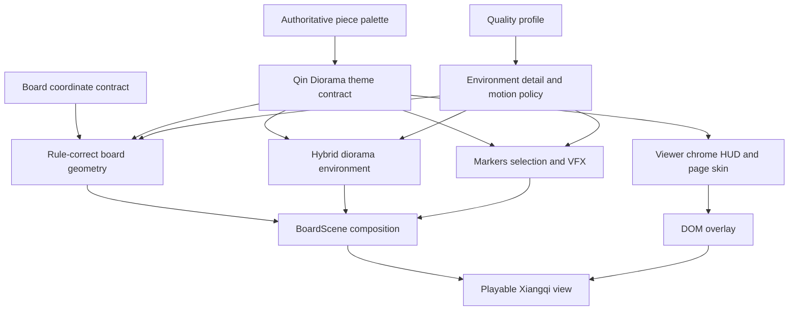
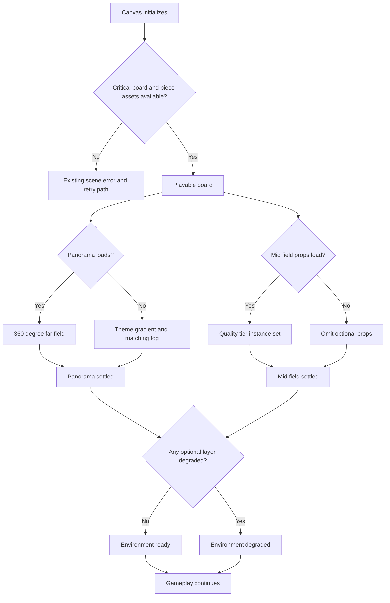

# Qin Terracotta Diorama Visual Restyle - Plan

## Goal Capsule

- **Objective:** 玩家在桌面和手机上看到一套统一的 Q 版秦俑世界，棋子、棋盘、远景和 HUD 属于同一微缩沙盘语言，同时保持现有本机双人对局完全可用。
- **Means:** 以现有 Q 版秦俑阵容为视觉权威，将写实要塞替换为“全 3D 棋盘与近景、实例化中景、360° 绘景远景”的混合秦陵沙盘，并建立共用主题与画质契约（KTD1、KTD2、KTD4）。
- **Authority:** `lib/xiangqi/**` 继续拥有规则真相；`components/xiangqi/runtime/board-coordinates.ts` 继续拥有逻辑格点到世界坐标的唯一映射；角色 manifest 和 `piece-palette.ts` 继续拥有角色资产与阵营配色。
- **Execution profile:** 表现层改造。先完成可审查的棋盘纵切，再扩展环境、交互反馈和 HUD，最后以浏览器视觉与性能证据收口。
- **Stop conditions:** 任一改造改变规则、坐标、存档或操作语义；关键棋盘/角色不能加载；桌面正式性能门槛未通过；可选环境失败会阻塞棋局。
- **Tail ownership:** 实施者负责删除被替代的要塞代码、文案和未引用资产，更新视觉基线与验证文档，并清理试验性场景分支。

---

## Product Contract

### Summary

本计划把现有写实山城棋盘改造成与 Q 版秦俑一致的收藏玩具式微缩战场。棋盘采用秦陵双重城垣、兵俑坑甬道和秦砖瓦纹样，背景采用轻量混合沙盘，HUD 与交互反馈同步换肤，但对局规则和角色资产契约保持不变。

### Problem Frame

当前角色已经采用大头、小身体、圆润陶土体块和少量矿物残彩的 Q 版秦俑语言，但棋盘仍是湿润青石、写实水道、城墙垛口和摄影感山谷天幕。两套比例、材质、细节密度和灯光语言互相竞争，Q 版棋子在画面中显得像后放入的图标，而不是场景中的主角。

现有高画质场景已经接近绘制预算，并且可见 Chromium 的 p95 帧间隔为 17.8–18.7 ms，尚未达到 16.7 ms 门槛。视觉统一不能依靠堆叠完整 3D 城池完成；背景方案必须同时约束几何、绘制调用、纹理下载、动态效果和移动端降档。

### Key Decisions

- **现有 Q 版秦俑阵容是整套场景的视觉权威。** (session-settled: user-approved — chosen over 继续保留写实兵人和写实要塞混搭: 用户确认后续模型以 Q 版秦俑产出为准) Governs R1, R4, R5, R6.
- **本轮覆盖棋盘、环境、灯光、镜头、HUD 皮肤和相关文案。** (session-settled: user-approved — chosen over 只替换棋盘与背景: 完整界面需要共享同一视觉语言) Governs R1, R5, R11.
- **本轮不重做角色动作与音频，只校准现有 VFX 的颜色、亮度和尺度。** (session-settled: user-approved — chosen over 同期扩展战斗演出系统: 先解决角色与场景的风格断裂) Governs R8.

### Requirements

**Visual language and scene composition**

- R1. 棋盘、环境、HUD 和交互反馈必须以现有 Q 版秦俑的体块比例、哑光陶土质感和阵营配色为统一视觉基准。
- R2. 新棋盘必须保留标准 9 × 10 交叉点、双九宫、河界断线、炮位与兵卒位角标，并保持现有格距、表面高度和落子坐标不变。
- R3. 环境必须采用全 3D 棋盘与近景、实例化或合并中景、360° 风格化绘景远景的混合沙盘，红黑换边、战场视角和巡游时不得出现明显穿帮。
- R4. 场景以暖色烧陶、黑漆、旧铜和白垩为主，并用朱砂、石绿、矿蓝等少量矿物色形成层次；建筑轮廓和装饰取自秦陵双重城垣、兵俑坑甬道、秦砖和秦瓦当，不使用唐宋式楼阁作为主体符号。
- R5. HUD、页面外框、品牌文案、场景标签、灯光、雾色和战场镜头必须与秦俑微缩沙盘统一，同时保留现有功能控件名称、焦点顺序和操作布局。

**Interaction and resilience**

- R6. 红黑棋子、普通合法落点、吃子落点、选中光环、键盘焦点、将军提示和终局面板必须在暖陶土背景上保持清晰区分，且不能只靠颜色表达状态。
- R7. 全景、装饰道具、环境动画或河面材质失败时必须降级到仍然同风格的静态表现，不能替换整个可操作棋盘或阻塞规则状态。
- R8. 改造不得改变规则、坐标、存档、输入锁、动画时间线、角色 GLB/骨架/动作契约或音频行为；现有 VFX 只允许做主题配色、亮度和屏幕占比校准。

**Quality and delivery**

- R9. `high → medium → low` 必须拥有明确且单调递减的环境细节、全景分辨率、阴影、动画和动态光策略；减少动态效果作为正交覆盖，保留当前画质档的静态细节与全景，仅关闭非必要环境运动和动画驱动更新；所有组合保持同一艺术方向。
- R10. 桌面高画质 1920 × 1080、DPR ≤ 1.5 时，静止绘制调用必须 ≤ 100、战斗峰值 ≤ 160、p95 帧间隔 ≤ 16.7 ms；首次可玩生产响应体必须保持 ≤ 12 MiB。
- R11. 视觉验收必须覆盖桌面与 390 px 手机、红黑双方、战场与俯视视角、高低画质、减少动态效果、菜单、进行中、选择/合法落点、吃子后、将军和终局状态。
- R12. 新全景和任何正式环境源资产必须保留生成说明、来源与授权记录、可编辑或无损源文件和网页运行时产物，且不得复制外部游戏的角色、纹理或场景资产。

### Acceptance Examples

- AE1. Covers R1, R5. **Given:** 首页停留在开始菜单。 **When:** 用户查看完整场景。 **Then:** 菜单、棋盘、棋子和远景共享暖陶土与矿物残彩语言，正文和主按钮仍清晰可读。
- AE2. Covers R2, R6. **Given:** 32 子初始局面和红方俯视视角。 **When:** 用户选择 `a3` 红兵。 **Then:** 90 个交叉点、全部棋子、选中光环和合法落点无遮挡，点击 `a4` 仍提交同一合法走子。
- AE3. Covers R3, R5. **Given:** 战场视角。 **When:** 用户换到黑方并启用自动巡游。 **Then:** 近中远景保持连续，环景没有明显接缝，场边道具不遮挡棋盘安全区。
- AE4. Covers R6, R8. **Given:** 一次合法吃子。 **When:** 现有攻击与击毁时间线播放。 **Then:** 调整后的 VFX 与秦俑色板一致，但事件顺序、输入锁和规则终态不变。
- AE5. Covers R9. **Given:** 一局进行中。 **When:** 用户依次切换 `high → low → high`。 **Then:** 世界布局和棋子位置不跳变，低档保持相同风格且不加载非必要装饰，回到高档后资源数量稳定。
- AE6. Covers R9, R11. **Given:** 减少动态效果已开启。 **When:** 用户进入战场视角。 **Then:** 巡游、旗帜、河面和尘雾保持静止，棋盘和 HUD 仍呈现完整主题。
- AE7. Covers R7. **Given:** 全景资源请求失败。 **When:** 用户开始并完成双方各一步。 **Then:** 场景退为主题渐变天空和匹配雾色，棋盘操作、历史和存档保持正常。
- AE8. Covers R7, R8. **Given:** WebGL 上下文在新环境加载完成后丢失并恢复。 **When:** 用户继续落子并悔棋。 **Then:** 场景收敛到权威局面，装饰层按可用状态恢复或降级，不重复注册资源。

### Scope Boundaries

**In scope**

- 棋盘表面、河界、底座轮廓、秦式装饰、环境近中远景、灯光、雾、战场镜头构图和主题化画质分档。
- 交互标记、选择光环、接触阴影、现有战斗 VFX 的主题校准，以及 HUD、页面外框、metadata、ARIA 场景描述和展示文案换肤。
- 可选环境资产的局部故障降级、视觉就绪信号、视觉回归、移动布局、真实 Canvas 拾取、性能与资源生命周期验收。

#### Deferred to Follow-Up Work

- 为“将军”新增帝印、镜头或全局棋盘特效。
- 重做角色动作、角色语音、背景音乐和环境音频主题。
- 新增第二套可切换主题、展示模式或自由摄影模式。
- 把环境道具提升为独立 GLB 资产包及完整的环境资产 manifest；本轮优先复用程序化、实例化和绘景方案。

**Outside this product change**

- 中国象棋规则、AI、联网对战、棋谱系统、账号和云存档。
- 现有 Q 版角色的几何、骨架、动作列表和阵营变体合同。

### Sources / Research

| Source                                                                                                                         | Planning impact                                                                  |
| ------------------------------------------------------------------------------------------------------------------------------ | -------------------------------------------------------------------------------- |
| `assets/characters/reviews/roster-contact-sheet-qin-terracotta.png`                                                            | 现有角色的轮廓、比例、陶土质感和阵营点缀色是视觉权威。                           |
| `docs/validation.md`                                                                                                           | 当前 87 次静止绘制和 17.8–18.7 ms p95 决定了混合背景和严格性能收口。             |
| [秦始皇帝陵博物院：真彩秦俑](https://bmy.com.cn/news/news/993.html)                                                            | 朱砂、石绿、石青、白和黑漆等矿物彩绘，以及对比色勾边，决定场景不能做成单色陶土。 |
| [UNESCO：秦始皇陵](https://whc.unesco.org/en/list/441)                                                                         | 矩形双重城垣、南北轴线和地下城市微缩结构决定棋盘外轮廓。                         |
| [中国国家博物馆：大瓦当](https://www.chnmuseum.cn/zp/zpml/kgfjp/202110/t20211027_251884.shtml)                                 | 夔凤纹、朱白彩饰、四门和角楼为装饰与边界提供依据。                               |
| [中国国家博物馆：葵纹瓦当](https://www.chnmuseum.cn/zp/zpml/kgfjp/202110/t20211027_251883.shtml)                               | 葵纹、动物纹、叶纹、树纹和水涡纹可用于低密度压印与河界装饰。                     |
| [Unity：FANTASIAN case study](https://unity.com/resources/case-study/fantasian)                                                | 绘制细节配合简化承载几何，证明微缩质感可以在移动端以混合方案保留。               |
| [Unity：Warpforge scenario pipeline](https://unity.com/blog/games/stunning-scenarios-in-warhammer-40000-warpforge)             | 2D、完整 3D和投影/绘景的取舍支持近中景 3D、远景绘景的选择。                      |
| [Blender Studio：Chunkification](https://studio.blender.org/blog/chunkification-creating-a-design-language-for-sprite-fright/) | 大体块、圆角、选择性细节和避免写实噪声用于把环境比例统一到 Q 版角色。            |
| [React Three Fiber performance](https://r3f.docs.pmnd.rs/advanced/scaling-performance)                                         | 按需渲染、实例化、复用材质和 LOD 是新增环境层的实现约束。                        |
| [WCAG 2.2 contrast](https://www.w3.org/WAI/WCAG22/Understanding/non-text-contrast)                                             | HUD、焦点环和状态图形需要可测的文字与非文字对比度。                              |

---

## Planning Contract

### Key Technical Decisions

- KTD1. **建立单一 Qin Diorama 主题合同。** 场景色板从 `piece-palette.ts` 的权威阵营色派生，并补充中性陶土、黑漆、白垩、矿蓝和旧铜语义；Three.js 材质、交互标记和 CSS 使用同一语义名称。 Governs R1, R4, R5, R6.
- KTD2. **采用混合沙盘环境。** 棋盘和近景保持全 3D，中景只使用合并或实例化模块，远景使用可覆盖红黑换边和巡游的 360° 绘景；不建立重型全 3D 城市。 Governs R3, R10, R12.
- KTD3. **冻结逻辑坐标和俯视拾取合同。** `BOARD_SPACING`、`BOARD_SURFACE_Y`、`squareToWorld()`、Canvas FOV、俯视高度和俯视 target 保持不变；美术围绕这些固定值设计，装饰节点不参与 raycast。 Governs R2, R6, R8.
- KTD4. **让画质配置拥有环境细节合同。** `QualityProfile` 增加单调递减的环境档位和全景变体；活动档只加载所需资源，减少动态效果关闭所有非棋子必要环境运动。 Governs R9, R10.
- KTD5. **按环境层隔离失败。** 全景失败退到主题渐变与雾，中景失败省略对应实例，河面 shader 失败退到静态釉面；只有关键棋盘或角色 LOD1 缺失继续使用现有阻塞式场景错误。 Governs R7, R8.
- KTD6. **沿用背景资产的来源记录模式。** 无损源、生成说明和网页运行时文件分开保存，运行时全景设置独立体积预算；外部资料只作为形制和配色依据。 Governs R12.
- KTD7. **HUD 只换皮肤和展示文案。** 复用 `GameHud` 的 DOM、ARIA、焦点行为、功能标签和移动响应布局，通过主题 token、装饰伪元素和少量非功能标记完成视觉统一。 Governs R5, R6, R8.
- KTD8. **用显式环境状态稳定视觉测试。** 场景向外暴露 `ready` 或 `degraded` 的可观察状态，截图等待该状态和固定相机，不依赖固定秒数猜测资源是否完成。 Governs R7, R11.

### High-Level Technical Design

主题合同把现有角色配色扩展成表现层共享语义。规则和坐标不依赖主题；场景、交互反馈和 DOM 皮肤只消费主题与画质配置。

可选环境资源独立收敛，不能接管棋局的可玩状态。

### Quality Matrix

| Dimension          | High                                            | Medium                           | Low                                 | Reduced motion override                |
| ------------------ | ----------------------------------------------- | -------------------------------- | ----------------------------------- | -------------------------------------- |
| Far field          | Highest approved panoramic variant              | Mid-resolution panoramic variant | Smallest approved panoramic variant | Same active variant, static            |
| Near and mid field | Full approved prop clusters                     | Reduced cluster density          | Core silhouette props only          | Static props only                      |
| Shadows            | Existing high-tier static shadow strategy       | Reduced existing shadow strategy | No environment shadows              | No additional animation-driven updates |
| River              | Low-amplitude glazed color motion               | Lower-rate glazed color motion   | Static glazed surface               | Static glazed surface                  |
| Ambient motion     | Scheduled flags and sparse dust                 | Lower cadence and density        | Disabled                            | Disabled                               |
| Failure fallback   | Theme gradient plus fog, optional props omitted | Same                             | Same                                | Same                                   |

Final panorama pixel dimensions and compressed byte targets are selected during U3 after visual comparison and browser memory evidence. R10 remains the owning total download and frame-time gate.

### Sequencing

1. U1 defines the visual and runtime contracts before any scene geometry changes.
2. U2 and U3 use those contracts to build the board and environment; U3 starts only after the U2 visual slice fixes scale and material language.
3. U4 calibrates camera and interaction feedback against the integrated scene.
4. U5 applies the same language to DOM surfaces and public copy without changing controls.
5. U6 freezes visual baselines, proves resilience and performance, and updates delivery evidence.

### System-Wide Impact

- **Rules and persistence:** No expected behavior change. Existing unit and end-to-end suites remain regression gates.
- **Rendering runtime:** Adds environment detail and failure state to the quality contract while preserving `frameloop="demand"`, the centralized scheduler and static-shadow pattern.
- **Input and accessibility:** Decorative geometry must not intercept Canvas input; DOM action labels and focus order stay stable; new colors need measured text and non-text contrast.
- **Assets and download:** Replaces the photographic fortress plate with versioned panoramic variants and adds lightweight repeated props without preloading all quality variants.
- **Documentation and testing:** SSR assertions, product copy, screenshots, performance evidence and background provenance all change intentionally.

### Risks & Dependencies

| Risk or dependency                                        | Impact                                                                | Mitigation                                                                                                                             |
| --------------------------------------------------------- | --------------------------------------------------------------------- | -------------------------------------------------------------------------------------------------------------------------------------- |
| Existing p95 already misses 16.7 ms                       | New scene can deepen the performance deficit                          | Measure after each environment layer; merge or instance props; remove old passes before adding new ones; keep R10 as a hard exit gate. |
| 360° panorama seam or wrong horizon                       | Black-side view and巡游 reveal the backdrop trick                     | Review both sides and controlled rotation before approving the source; keep major landmarks away from the seam.                        |
| Warm palette reduces faction or marker contrast           | Players misread pieces and legal states                               | Reserve cinnabar and verdigris for factions; use luminance and shape differences for markers; verify grayscale and WCAG contrast.      |
| Decorative geometry intercepts raycasts                   | Valid board clicks fail intermittently                                | Disable raycast on environment nodes and rerun red/black desktop and touch pointer flows.                                              |
| Quality switching retains multiple environments           | GPU resources grow during a long match                                | Load active variants on demand, dispose replaced textures and geometry, and assert high→low→high resource stability.                   |
| Optional asset failure reaches Canvas boundary            | A decorative problem hides the whole game                             | Apply KTD5 and add route-failure browser tests before visual sign-off.                                                                 |
| External historical references are over-literal or copied | Art direction becomes museum reconstruction or creates licensing risk | Translate only shapes, layouts and palettes into original assets; keep source and authorization records per R12.                       |

---

## Implementation Units

### U1. Establish the Qin Diorama Theme and Quality Contract

- **Goal:** 建立场景、交互反馈和 HUD 共用的视觉语义，并让画质档能够控制环境复杂度。
- **Requirements:** R1, R4, R6, R9, R10.
- **Dependencies:** None.
- **Files:**
  - Create `components/xiangqi/scene/scene-theme.ts`.
  - Modify `components/xiangqi/pieces/piece-palette.ts`.
  - Modify `components/xiangqi/runtime/quality.ts`.
  - Create `tests/unit/runtime/scene-theme.test.ts`.
  - Modify `tests/unit/runtime/piece-palette.test.ts`.
  - Modify `tests/unit/runtime/quality.test.ts`.
  - Create `docs/qin-diorama-art-direction.md`.
- **Approach:**
  1. Define semantic theme tokens for neutral clay, black lacquer, chalk, mineral blue, aged bronze, faction accents, state markers and HUD surfaces under KTD1.
  2. Derive faction-sensitive tokens from `FACTION_COLORS` instead of duplicating hex values.
  3. Extend the immutable quality profiles with the environment detail and panorama selection required by KTD4.
  4. Record the approved silhouette, material, motif, lighting, safe-zone and do-not-use guidance in the art-direction document with links to R12 sources.
- **Patterns to follow:** Immutable `QUALITY_PROFILES`; manifest-backed faction palette tests; one exported source of truth per runtime contract.
- **Test scenarios:**
  - Each faction-sensitive scene token resolves from the corresponding authoritative palette value.
  - High, medium and low environment detail values decrease monotonically and the returned profiles remain frozen shared objects.
  - Reduced-motion policy disables every ambient environment motion flag without changing the active piece LOD.
  - Theme state colors preserve distinct luminance or shape roles for legal, capture and keyboard-focus feedback.
- **Verification:** An implementer can render theme swatches and inspect one profile object without finding a second hard-coded scene palette or an unclassified environment cost.

### U2. Build the Rule-Correct Qin Terracotta Board Slice

- **Goal:** 把湿石城堡棋台替换为圆角厚陶质秦陵沙盘，同时保持所有规则几何与落子坐标。
- **Requirements:** R1, R2, R4, R6, R10.
- **Dependencies:** U1.
- **Files:**
  - Modify `components/xiangqi/scene/BoardSurface.tsx`.
  - Create `components/xiangqi/scene/board-geometry.ts`.
  - Modify `components/xiangqi/runtime/board-coordinates.ts` only if comments or exported invariants need clarification; do not change coordinate values.
  - Create `tests/unit/runtime/board-geometry.test.ts`.
  - Modify `tests/unit/runtime/board-coordinates.test.ts`.
  - Modify `tests/rendered-html.test.mjs`.
- **Approach:**
  1. Move pure board segments and deterministic ornament placements into testable geometry helpers while keeping `makeBoardSegments()` behavior unchanged.
  2. Replace stone slabs, wet patches, metallic grid and crenellated fortress foundation with chunky clay tiles, dark-lacquer or chalk grid lines, rounded double low walls, four gate cues and sparse Qin brick/tile impressions.
  3. Replace realistic water with a recessed mineral-blue/stone-green glazed river and water-swirl ornament; preserve the existing river gap and both inscriptions.
  4. Keep every ornament outside hit circles and the piece footprint envelope defined by KTD3.
  5. Complete a desktop and 390 px board-only visual review before U3 expands the environment.
- **Execution note:** Treat this as the art-direction vertical slice. Freeze the board scale, material roughness and ornament density before producing the panoramic source.
- **Patterns to follow:** Existing instanced slabs and grid-line generation; deterministic seeded placement; explicit texture/material disposal.
- **Test scenarios:**
  - Pure segment generation still produces ten ranks, nine files with the standard river break, both palace diagonals and all required corner marks.
  - `squareToWorld()` maps all 90 squares to the same world positions and surface height as before the restyle.
  - Decorative placement stays outside the 90 hit circles and the maximum piece footprint.
  - Low-quality reduced-motion rendering shows a static river without changing grid or inscription geometry.
  - SSR smoke validation detects the Qin board composition and no longer requires obsolete stone/wet-patch implementation names.
- **Verification:** The board passes geometry tests and a fixed-camera comparison shows the Q pieces as the primary silhouettes, with every intersection and river rule visible at desktop and mobile size.

### U3. Replace the Fortress with a Resilient Hybrid Diorama Environment

- **Goal:** 用秦陵微缩近中景和 360° 风格化绘景替换摄影感山谷，并让可选资产独立失败和降档。
- **Requirements:** R3, R4, R7, R9, R10, R12.
- **Dependencies:** U1, U2.
- **Files:**
  - Create `components/xiangqi/scene/DioramaEnvironment.tsx`.
  - Modify `components/xiangqi/scene/BoardScene.tsx`.
  - Remove `components/xiangqi/scene/FortressEnvironment.tsx` after the replacement is wired.
  - Create `assets/background/qin-diorama-panorama-v1.prompt.md`.
  - Create an approved lossless panorama source under `assets/background/`.
  - Create quality-appropriate runtime panorama variants under `public/background/`.
  - Modify `tests/rendered-html.test.mjs`.
  - Modify `tests/e2e/resilience.spec.ts`.
- **Approach:**
  1. Split far field, diorama lighting/fog, repeated props and ambient motion into independent environment layers under KTD2 and KTD5.
  2. Build near and mid field from a small modular kit of clay walls, pit corridors, mound silhouettes, gate markers, tents, braziers, banner bases and weapon racks; merge static geometry or instance repeated props.
  3. Author an original seamless panoramic source whose horizon and landmark placement work from both red and black battle views.
  4. Load only the active quality variant and expose the KTD8 environment state after each optional layer reaches ready or degraded.
  5. Match background, fog and hemisphere light colors so the fallback gradient is visibly intentional.
  6. Keep all decorative nodes non-interactive and route ambient animation through `useScheduledFrame`; pause it during actions as the current scene does.
- **Patterns to follow:** Current background source/prompt/runtime separation; `Suspense` for optional texture loading; centralized frame scheduler; shared geometries and materials; scene-level quality profile.
- **Test scenarios:**
  - Red and black battle views plus a controlled orbit show no panorama seam, horizon jump or billboard inversion.
  - High, medium and low profiles load only their active panorama variant and approved prop density.
  - A failed panorama request produces the theme gradient and leaves a playable board.
  - A failed optional prop or river resource omits that layer without invoking the whole-Canvas scene error.
  - Context loss after environment readiness restores or degrades optional layers and still permits the next legal move and undo.
  - Repeated high→low→high switching returns texture, geometry and scheduler registrations to stable counts.
- **Verification:** The old fortress environment is no longer imported or preloaded, optional failure scenarios pass, and the integrated scene stays within R10 before HUD work begins.

### U4. Recompose Camera, Interaction Feedback, and Existing VFX

- **Goal:** 让导演机位、落点反馈和现有战斗效果适配新沙盘，同时保持 Canvas 拾取和时间线行为。
- **Requirements:** R3, R5, R6, R8, R11.
- **Dependencies:** U2, U3.
- **Files:**
  - Modify `components/xiangqi/scene/BoardCamera.tsx`.
  - Modify `app/BoardViewer.tsx`.
  - Modify `components/xiangqi/game/GameBoardLayer.tsx`.
  - Modify `components/xiangqi/pieces/PieceActor.tsx`.
  - Modify `components/xiangqi/vfx/piece-vfx-profiles.ts`.
  - Modify `components/xiangqi/vfx/PieceCombatVfx.tsx` only where theme scale or color needs runtime support.
  - Modify `components/xiangqi/scene/BattlePostprocessing.tsx` only if the existing capture bloom needs softening.
  - Modify `tests/e2e/pointer-board.spec.ts`.
  - Modify `tests/e2e/mobile.spec.ts`.
- **Approach:**
  1. Recompose only the battle destination and tone mapping to frame the chunky board and horizon; preserve every overhead parameter in KTD3.
  2. Replace hard-coded marker, keyboard-focus, selection and contact-shadow colors with KTD1 theme semantics while preserving distinct shapes and state meaning.
  3. Calibrate existing VFX to the new material response and neighboring-grid footprint without changing cue timing, animation selection or event dispatch.
  4. Keep ambient scene objects out of selective bloom and avoid a second postprocessing pipeline.
  5. Validate pointer and touch mapping from both red and black overhead views.
- **Patterns to follow:** Existing `event.delta` drag/click boundary; instanced hit grid and marker meshes; capture-only selective bloom; rule-first presentation convergence.
- **Test scenarios:**
  - Desktop pointer selection and move succeed from red and black overhead views after the camera changes.
  - 390 px touch selection and move succeed after a side switch without horizontal overflow or HUD occlusion.
  - Legal, capture and keyboard-focus states remain distinguishable in full color and grayscale.
  - A normal move and a capture retain the same interaction lock, event order, final square and unlock behavior.
  - Reduced motion uses the existing shortened presentation and introduces no ambient camera or environment movement.
- **Verification:** Existing gameplay and presentation suites remain green, and visual review confirms the camera favors pieces and grid rather than background decoration.

### U5. Reskin HUD, Viewer Chrome, and Public Copy

- **Goal:** 把暗黑写实要塞界面改为陶板、黑漆和旧铜细边的秦俑主题，同时保持全部功能和可访问性合同。
- **Requirements:** R1, R5, R6, R8, R11.
- **Dependencies:** U1, U3, U4.
- **Files:**
  - Modify `app/globals.css`.
  - Modify `app/page.tsx`.
  - Modify `app/layout.tsx`.
  - Modify `app/BoardViewer.tsx`.
  - Modify `components/xiangqi/hud/GameHud.tsx` only for non-functional decorative markup when CSS alone is insufficient.
  - Modify `tests/rendered-html.test.mjs`.
  - Modify relevant role/name assertions under `tests/e2e/` only when they describe obsolete theme copy; retain action-label assertions.
- **Approach:**
  1. Replace global fortress tokens and dark glass panels with theme-backed clay, lacquer, chalk and bronze surfaces; use motifs only on large borders, seals and headings.
  2. Keep modern readable Chinese for body text and controls; do not use Qin small-seal script for functional labels.
  3. Update metadata, hero copy, design notes, scene ARIA description and corner label from realistic fortress language to Qin terracotta diorama language.
  4. Preserve menu, confirmation, turn, history, keyboard, settings, warning and game-over DOM semantics and responsive placement under KTD7.
  5. Theme the existing check indicator with shared state tokens and preserve its current non-color cue; do not add the deferred imperial-seal, camera or global-board check effect.
  6. Check 390 px safe zones so the board remains visible between top cards and bottom controls.
- **Patterns to follow:** Existing CSS custom properties, `focus-visible` treatment, inert confirmation boundary, mobile breakpoints and DOM control sizing.
- **Test scenarios:**
  - Menu, warning, confirmation, settings and game-over panels retain their roles, labels, focus order and button behavior after the reskin.
  - All functional Playwright locators for start, continue, view, undo, resign, restart and settings still resolve unchanged.
  - Body text reaches 4.5:1 contrast and focus/state boundaries reach 3:1 against every active panel background.
  - The existing check indicator remains distinguishable from normal turn state without relying on color alone.
  - At 390 × 844, no horizontal overflow occurs and every action target remains at least 24 × 24 CSS px.
  - Public HTML contains the new Qin diorama metadata and ARIA description with no user-visible “写实要塞/山城” copy.
- **Verification:** Keyboard-only and touch flows work without locator rewrites for functional actions, and the integrated screenshot reads as one art direction from page frame to pieces.

### U6. Freeze Visual, Resilience, and Performance Evidence

- **Goal:** 用可重复浏览器证据证明新主题没有破坏对局、故障恢复、资源生命周期或性能，并清理旧主题资产。
- **Requirements:** R7, R9, R10, R11, R12.
- **Dependencies:** U1, U2, U3, U4, U5.
- **Files:**
  - Modify `tests/e2e/visual.spec.ts`.
  - Modify `tests/e2e/mobile.spec.ts`.
  - Modify `tests/e2e/performance.spec.ts`.
  - Modify `tests/e2e/resilience.spec.ts`.
  - Modify `tests/e2e/helpers.ts` only if a new environment readiness helper is needed; do not change board coordinate projection unless KTD3 is intentionally revised.
  - Update approved files under `tests/visual/baselines/`.
  - Modify `scripts/verify-runtime-budgets.mjs` to include environment assets.
  - Modify `README.md`.
  - Modify `docs/validation.md`.
  - Remove obsolete `public/background/fortress-valley-v1.jpg`, `public/background/fortress-valley-v1.png`, and `assets/background/fortress-valley-v1.prompt.md` only after no runtime or documentation reference remains.
- **Approach:**
  1. Replace fixed-delay visual readiness with KTD8 state waiting and lock reduced motion plus camera before screenshots.
  2. Expand the visual matrix to the smallest set that covers menu, playing, selected/legal, settled post-capture, check, black-side battle view, high/low quality, reduced-motion, 390 px, settings and terminal UI.
  3. Add optional-resource failure and high→low→high lifecycle scenarios to the existing resilience coverage.
  4. Profile each environment layer in a visible production Chromium run; reduce material count, prop density, shadow work or panorama cost until R10 passes rather than weakening the threshold.
  5. Record final draw calls, frame interval, geometry/texture counts, active panorama bytes and first-playable bytes in `docs/validation.md`.
  6. Update the README architecture, source records and quality matrix, then remove every obsolete fortress reference and unused asset.
- **Execution note:** Regenerate screenshots only after a human reviews the intended desktop and mobile compositions. Run the clean comparison again after updating baselines.
- **Patterns to follow:** Existing explicit visual-update command, production response-byte measurement, visible-Chromium performance gate, context-loss test and validation evidence format.
- **Test scenarios:**
  - Desktop high battle view, desktop low overhead, black-side battle view, selected/legal state and game-over UI match approved deterministic baselines.
  - Settled post-capture, check and reduced-motion states match approved deterministic baselines without adding new check VFX.
  - Mobile low playing, settings-open and terminal states fit 390 × 844 without clipped controls or hidden intersections.
  - Missing panorama and missing optional prop assets produce `degraded` environment status and allow a two-sided move sequence.
  - High→low→high switching and 100 ambient/action cycles leave scheduler, geometry and texture counts stable after settling.
  - The full existing two-player, save/restore, undo, resign, audio, keyboard, pointer and context-loss suites pass without rules-layer changes.
  - Visible production Chromium meets every R10 threshold and downloads only the active environment variant before first playable.
- **Verification:** All commands and thresholds in the Verification Contract pass, the final validation document contains dated evidence, and `rg` finds no active import, preload, copy or test assertion for the retired fortress theme.

---

## Verification Contract

| Command                                                        | Purpose                                                                                  | Exit gate                                                                                       |
| -------------------------------------------------------------- | ---------------------------------------------------------------------------------------- | ----------------------------------------------------------------------------------------------- |
| `npm run typecheck`                                            | Validate TypeScript contracts across theme, quality and scene composition.               | No type errors.                                                                                 |
| `npm run lint`                                                 | Validate React, hooks, JSX and accessibility conventions.                                | No lint errors or new ignored rules.                                                            |
| `npm run test:unit`                                            | Regress rules, game and presentation behavior.                                           | All existing suites pass without changed rule expectations.                                     |
| `npm run test:runtime`                                         | Validate palette, quality, coordinates, board geometry and resource lifecycle contracts. | All runtime suites pass, including monotonic environment tiers and stable coordinate mapping.   |
| `npm test`                                                     | Build the production worker and run SSR/scene wiring smoke checks.                       | Production build succeeds and HTML names the Qin diorama while preserving controls.             |
| `npm run test:e2e`                                             | Exercise full browser gameplay, input, save, resilience and mobile flows.                | All Chromium projects pass, including optional environment degradation.                         |
| `npm run test:visual:update` followed by `npm run test:visual` | Approve intentional baselines, then prove deterministic rendering.                       | Clean comparison passes at the repository pixel threshold after review.                         |
| `npm run test:budget`                                          | Measure runtime character and environment assets.                                        | Character budgets stay intact and active environment assets keep first playable within R10.     |
| `npm run test:performance:headed`                              | Measure visible production Chromium rendering.                                           | Stationary draw calls ≤100, peak ≤160, p95 frame interval ≤16.7 ms, and first playable ≤12 MiB. |

Target-device follow-up remains required for a modern mid/high-end phone: 390 × 844 layout, p95 frame interval ≤33.3 ms, stable touch picking, and no GPU-context instability during quality switching.

---

## Definition of Done

### Global Completion Criteria

- The scene reads as a Q 版秦俑微缩战场 in every required state, with no remaining visual dependency on the realistic fortress plate.
- Rules, board coordinates, storage schema, functional UI labels, character asset contract, animation timeline and audio behavior remain unchanged and all existing behavioral tests pass.
- Optional environment failures degrade locally, preserve a visible board and permit both sides to continue the match.
- High, medium, low and reduced-motion modes share one art direction and meet their visual, lifecycle and performance gates.
- All new environment assets have source, generation and authorization records; all retired fortress assets and references are removed after replacement verification.
- Approved visual baselines and dated desktop/mobile validation evidence are checked in.
- Dead-end shaders, unused props, experimental palettes, duplicate quality variants and abandoned refactor code are removed from the final diff.

### Per-Unit Completion

| Unit | Done signal                                                                                                         |
| ---- | ------------------------------------------------------------------------------------------------------------------- |
| U1   | One tested theme and environment-quality contract drives scene and UI semantics.                                    |
| U2   | The Qin terracotta board passes topology/coordinate tests and the board-only visual slice is approved.              |
| U3   | The hybrid environment works from both sides, degrades locally and stays inside the interim rendering budget.       |
| U4   | Camera, markers and VFX fit the new scene while pointer, touch and presentation behavior stay unchanged.            |
| U5   | Every HUD state and public page surface uses the new theme without functional or accessibility regression.          |
| U6   | Behavioral, visual, resilience, lifecycle, download and headed performance gates pass with final evidence recorded. |
