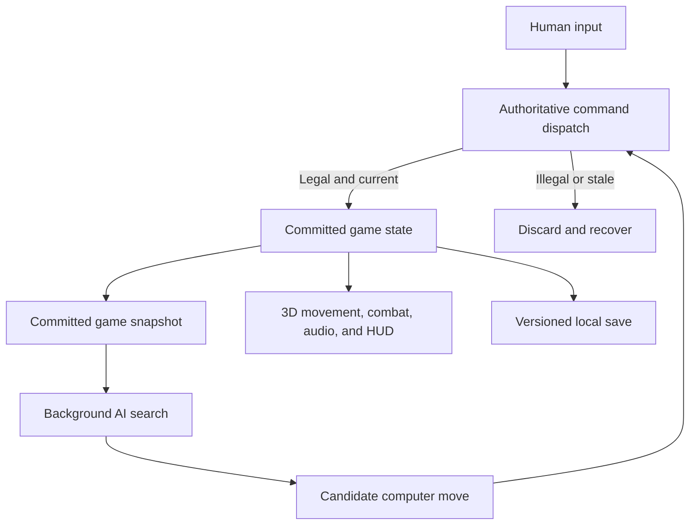
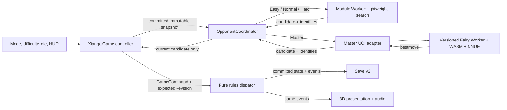
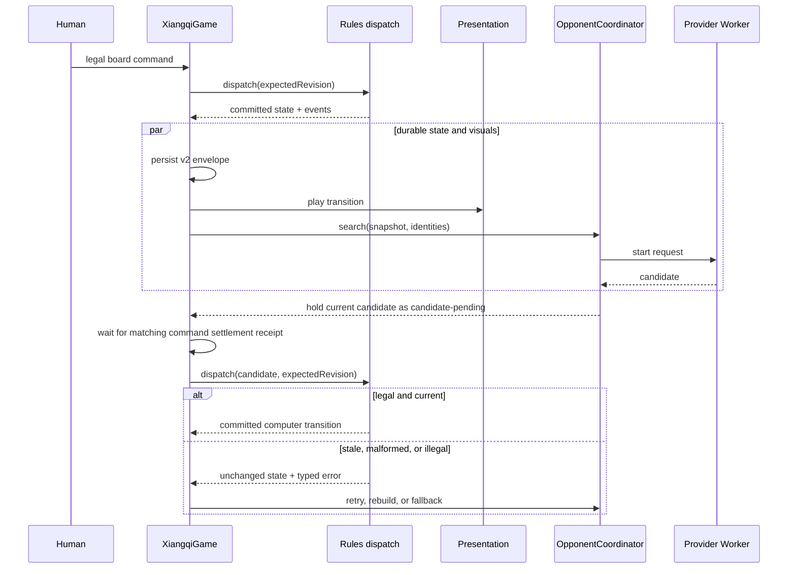
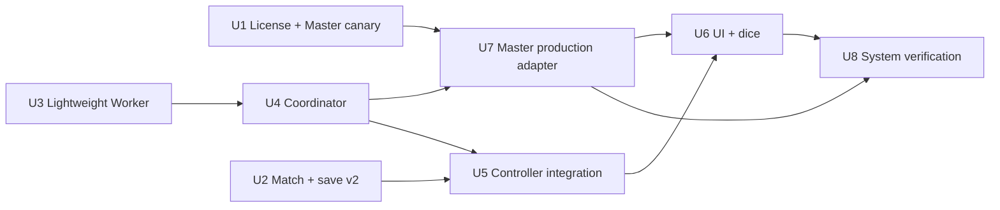

# Client-Side AI Mode - Plan

## Goal Capsule

- **Objective:** A solo player can complete a reliable Chinese chess game against the computer in the existing 3D experience without a gameplay backend.
- **Means:** Extend the authoritative game pipeline with a built-in lightweight Worker and a version-pinned Fairy-Stockfish WebAssembly Master tier (KTD1, KTD3, KTD5).
- **Product authority:** This contract owns computer-match setup, turn behavior, difficulty shape, persistence, fallback behavior, licensing, and user-visible acceptance criteria.
- **Open blockers:** None. Runtime calibration may tune search budgets without changing the four difficulty tiers or their ordering.
- **Execution profile:** Code implementation with browser runtime, deployment-header, asset-provenance, and cross-browser verification.
- **Stop conditions:** Stop Master activation or release if the GPL corresponding source cannot reproduce the distributed engine, the selected NNUE lacks compatible redistribution evidence, or production cannot provide cross-origin isolation. These conditions never block Easy–Hard or their automatic Hard fallback.
- **Tail ownership:** `ce-work` owns local implementation and verification; shipping remains a separate user-authorized action.

---

## Product Contract

### Summary

Add fully client-side computer play by extending the current command, save, and presentation boundaries with an isolated opponent coordinator.
Easy through Hard use a built-in Worker; Master lazy-loads a pinned Fairy-Stockfish WebAssembly runtime and falls back without bypassing the authoritative rules.

### Problem Frame

The current product requires two people sharing one device, so a solo visitor can inspect the board but cannot complete a meaningful match.
The existing rules, persistence, and 3D battle presentation already support a full game; the missing capability is a computer opponent that can participate without freezing the scene or becoming a second source of chess truth.

### Actors

- A1. **Solo player:** Starts, resumes, plays, changes presentation settings, and receives clear feedback while the computer is thinking.
- A2. **Lightweight opponent:** Is immediately available, supplies the Easy, Normal, and Hard levels, and never requires a gameplay network service.
- A3. **Master opponent:** Supplies stronger play after its optional runtime assets are downloaded and cached.
- A4. **Authoritative game runtime:** Validates commands, owns revisions and outcomes, persists committed state, and drives presentation events.

### Key Decisions

- **Hybrid client engine.** (session-settled: user-directed — chosen over lightweight-only or strong-only: it combines immediate play with an optional high-strength tier.) Governs R4–R8.
- **GPL-3.0 open-source distribution.** (session-settled: user-approved — chosen over leaving the project unlicensed: it permits compliant distribution of the selected GPL engine.) Governs R19–R21.
- **Random side assignment.** (session-settled: user-directed — chosen over fixed or manual side selection: the die roll makes each new match impartial and thematic.) Governs R2, R3.
- **No undo in computer matches.** (session-settled: user-directed — chosen over single-ply undo: removing the control avoids an ambiguous computer-to-move state.) Governs R13.
- **One rules authority.** Computer engines propose moves; the existing game runtime alone decides whether a move is legal and committed. Governs R8, R9, R11.

The authority boundary is shared by both engine tiers:



### Requirements

**Mode and match setup**

- R1. The start experience must offer both the existing local two-player mode and a computer mode without changing the rules of local play.
- R2. Every new computer match must use one fair six-sided die result to assign the player to red on odd values and black on even values.
- R3. Red must always move first; when the player is assigned black, the computer must open the game after the die result is presented.
- R4. Computer mode must offer Easy, Normal, Hard, and Master, with the first three available from the built-in lightweight engine and Master backed by the optional strong engine.

**Engine availability and authority**

- R5. All computer move calculation must run in the browser without calling a gameplay backend.
- R6. The lightweight opponent must be ready with the playable application and must not require a second download before a computer match can start.
- R7. Master may download its engine assets on first use, then must reuse a valid local cache and fall back to Hard when loading, initialization, or execution fails.
- R8. Both engines must return candidate moves against an immutable position snapshot carrying the expected game revision.
- R9. A candidate move must be committed only through the authoritative command path; stale, malformed, or illegal candidates must not change the game.
- R10. Computer search must not block camera movement, settings, animation, audio, or HUD updates on the browser main thread.

**Turn and presentation behavior**

- R11. A committed computer move must use the same movement, capture, check, terminal, visual-effect, and audio behavior as an equivalent human move.
- R12. During the computer turn, board commands must be locked while camera controls, presentation settings, and an accurate thinking indicator remain available.
- R13. Computer mode must not expose an undo control, while the existing local two-player undo capability remains unchanged.
- R14. Restarting, replacing, hiding, or restoring a match must invalidate obsolete searches so that late results cannot enter the current game.
- R15. A terminal game must stop pending search and must never accept another computer move.

**Persistence and recovery**

- R16. A computer-match save must preserve the mode, die result, human side, difficulty, selected engine tier, committed command history, and current revision in a versioned format.
- R17. Resuming a save must restore the same sides and difficulty, then continue automatically when the restored position belongs to the computer.
- R18. An incompatible or damaged computer-mode save must follow the product's existing safe recovery behavior without interpreting partial AI metadata as a valid game.

**Open-source distribution**

- R19. The repository and distributed combined client must use GPL-3.0-compatible terms, with `GPL-3.0-only` as the project SPDX declaration unless the owner later elects an “or later” grant.
- R20. Every distributed engine binary or WebAssembly module must ship with its exact corresponding source, license notices, local modifications, and reproducible build instructions.
- R21. Neural weights, 3D assets, audio, fonts, and other non-code material must have recorded provenance and redistribution terms compatible with the released product.

**Difficulty and quality**

- R22. Easy, Normal, and Hard must produce visibly different playing strength through bounded search behavior, not by submitting illegal moves or ignoring rules.
- R23. Easy may introduce controlled suboptimal choices, while every difficulty must still respect the complete `popular-v1` rule set and terminal-state handling.
- R24. Random side assignment and any controlled move variety must support deterministic seeds in automated tests without making production outcomes predictable by a fixed constant.
- R25. Engine failure must degrade the opponent or end the pending attempt with a recoverable message; it must never leave the board permanently locked.

### Key Flows

- F1. **New computer match**
  - **Trigger:** A1 chooses computer mode.
  - **Actors:** A1, A4
  - **Steps:** The player selects difficulty, rolls the die, sees the assigned side, and starts from the standard initial position.
  - **Outcome:** Red becomes the active side, and the computer starts automatically when it owns red.
  - **Covers:** R1–R4, R12

- F2. **Human move followed by computer response**
  - **Trigger:** A1 commits a legal move that does not end the game.
  - **Actors:** A1, A2 or A3, A4
  - **Steps:** The game commits and presents the human move, the opponent searches the resulting revision, and A4 validates and commits the returned candidate.
  - **Outcome:** The computer move uses the normal presentation timeline and control returns to the player only after that timeline settles.
  - **Covers:** R8–R12, R15

- F3. **Master activation and fallback**
  - **Trigger:** A1 starts or resumes a Master match without a usable cached engine.
  - **Actors:** A1, A2, A3, A4
  - **Steps:** The application discloses the download, loads and validates the strong engine, and either starts Master or offers the automatic Hard fallback.
  - **Outcome:** The player can continue the same match without a board deadlock.
  - **Covers:** R7, R12, R25

- F4. **Interrupted or superseded search**
  - **Trigger:** The page hides, the match restarts, the save is replaced, or the engine tier changes while a search is pending.
  - **Actors:** A2 or A3, A4
  - **Steps:** A4 invalidates the request and rejects any result whose match identity or revision no longer matches.
  - **Outcome:** Only the current game may receive a move.
  - **Covers:** R8, R9, R14

- F5. **Resume computer match**
  - **Trigger:** A1 continues a valid saved computer match.
  - **Actors:** A1, A2 or A3, A4
  - **Steps:** A4 restores the rules state and mode metadata, converges visuals to that state, then starts a search only if it is the computer's turn.
  - **Outcome:** The restored match continues with the same player side and difficulty.
  - **Covers:** R16–R18

### Acceptance Examples

| ID | Covers | Given | When | Then |
| --- | --- | --- | --- | --- |
| AE1 | R2, R3 | A new computer match receives die value 5 | The die settles | The player is red and may make the first move |
| AE2 | R2, R3 | A new computer match receives die value 4 | The die settles | The player is black and the computer opens as red |
| AE3 | R7, R25 | Master assets are unavailable | The player starts Master | The application explains the fallback, continues on Hard, and unlocks the board at the proper turn |
| AE4 | R8, R9, R14 | A search is running for revision 7 | The player restarts before the result arrives | The revision-7 result is discarded and the new game remains unchanged |
| AE5 | R9, R25 | An engine returns a malformed or illegal candidate | A4 validates it | No move is committed and the application retries or falls back without corrupting state |
| AE6 | R10, R12 | The computer is thinking on a slower device | The player moves the camera or changes volume | Those controls respond while board commands remain locked |
| AE7 | R11 | The computer captures a piece | The move is committed | The ordinary attack, hit, destroy, audio, history, and resulting check or terminal cues play once |
| AE8 | R13 | A computer match is active | The HUD is displayed | No undo control is available, while local two-player mode still exposes its existing control |
| AE9 | R15 | A move ends the game | A queued or late engine result arrives | The result is ignored and the terminal state remains authoritative |
| AE10 | R16, R17 | A saved game belongs to the computer at revision 12 | The page is refreshed and the game is continued | The same side and difficulty return and one search begins for revision 12 |
| AE11 | R22, R23 | The same representative position is played at each lightweight difficulty | The configured search budget is applied | Hard evaluates more deeply than Normal and Easy, while all returned moves remain legal |
| AE12 | R19–R21 | A production build contains a GPL engine module | The release package is audited | Its corresponding source, build path, notices, weights, and asset provenance are available and match the distributed version |

### Success Criteria

- A player can start and finish complete games while assigned either red or black at every difficulty.
- All accepted computer commands pass the existing legal-move and revision checks; no visual or engine state can bypass the rules state.
- A pending search produces no main-thread freeze perceptible in camera, settings, animation, or HUD interaction on the supported desktop and mobile targets.
- Master works after its first successful load without repeatedly downloading unchanged assets, and its failure path leaves a playable Hard match.
- Refresh, backgrounding, restart, terminal state, and engine failure do not produce duplicate moves, stale moves, permanent input locks, or mismatched saves.
- Existing local two-player rules, controls, persistence, and battle presentation continue to pass their current automated and browser tests.
- A release audit can reconstruct every distributed GPL engine artifact and verify the redistribution rights for weights and media.

### Scope Boundaries

- No gameplay backend, server-side engine, account, cloud save, anti-cheat system, or online match is introduced.
- No hint button, position evaluation bar, analysis board, post-game engine review, or replay coaching is included.
- No adaptive player profiling, learned difficulty, ranked rating, or telemetry-driven model tuning is included.
- Computer mode has no undo; local two-player undo remains outside this feature's changes.
- Exact tournament long-check and long-capture adjudication remains outside the existing `popular-v1` ruleset and this feature.

### Dependencies and Assumptions

- The existing pure rules API in `lib/xiangqi/` remains the sole legality and outcome authority.
- The existing command, domain-event, presentation-lock, and local-save boundaries can be extended without duplicating the game controller.
- Supported browsers provide Web Workers; Master additionally requires WebAssembly, while the lightweight fallback remains available when the strong runtime is unsupported.
- The project owner has authority to release the project's original code and commissioned or generated assets under the selected terms.
- Master uses the official `fairy-stockfish-nnue.wasm@1.1.12` browser distribution after a production canary proves its Xiangqi UCI path; `1.1.11` is the pinned rollback candidate if that new release fails the canary.
- Master requires a secure, cross-origin-isolated page. Failure to provide that capability degrades only Master; Easy through Hard remain playable.

### Sources and Research

- `lib/xiangqi/engine.ts`, `lib/xiangqi/types.ts`, and `lib/xiangqi/index.ts` establish the pure legal-move, revision, command, and event authority that computer play must reuse.
- `components/xiangqi/XiangqiGame.tsx`, `components/xiangqi/game/GameBoardLayer.tsx`, and `components/xiangqi/audio/SemanticAudioDirector.ts` establish the current input-lock and presentation pipeline.
- `components/xiangqi/game/storage.ts` and `lib/xiangqi/persistence.ts` show the versioned local-save boundary that requires computer-mode metadata.
- [Using Web Workers](https://developer.mozilla.org/en-US/docs/Web/API/Web_Workers_API/Using_web_workers) supports off-main-thread browser calculation.
- [WebAssembly](https://developer.mozilla.org/en-US/docs/WebAssembly) establishes the browser runtime used by the optional strong tier.
- [Pikafish](https://github.com/official-pikafish/Pikafish) is a GPL-3.0 UCI Chinese chess engine and records its NNUE training-data acknowledgement.
- [Fairy-Stockfish WASM](https://github.com/fairy-stockfish/fairy-stockfish.wasm) is a GPL-3.0 WebAssembly variant-engine distribution with Xiangqi support.
- [GNU GPL FAQ](https://www.gnu.org/licenses/gpl-faq.html) explains corresponding-source duties when GPL binaries, JavaScript, or browser-delivered programs are distributed.

---

## Planning Contract

### Product Contract Preservation

The Product Contract above is unchanged. The implementation must satisfy R1–R25 and the twelve acceptance examples without broadening the feature into analysis, hints, online play, or AI-specific rule authority.

### Key Technical Decisions

- **KTD1 — Two providers behind one candidate-move contract.** `OpponentProvider` accepts an immutable position snapshot plus match, request, and revision identity, and returns either a candidate move or a typed recoverable failure. Easy–Hard use the lightweight provider; Master uses the UCI provider. This inherits the session-settled hybrid decision and governs R4–R10.
- **KTD2 — Main-thread coordination, authoritative commit.** `OpponentCoordinator` owns provider lifecycle, validates runtime messages, rejects obsolete identities, and releases a candidate only to the current `XiangqiGame` controller. One controller-owned, tokenized command gate returns a typed committed/rejected/superseded receipt only after dispatch, persistence, presentation, and external `onAction` work settle. The controller re-dispatches the move with `expectedRevision`; neither provider mutates state, and an older action's completion cannot unlock a replacement match. This governs R8, R9, R11, R14, and R15.
- **KTD3 — Deterministic, interruptible lightweight search.** A dedicated module Worker runs iterative-deepening negamax with alpha-beta pruning as resumable bounded batches, yielding to a real Worker event-loop task boundary between batches so stop messages are observable. Node/depth budgets are the reproducible strength control; wall time is a safety ceiling. Search publishes only the last fully completed depth and accepts an explicit seed for tests and Easy-level move variety. This governs R5, R6, R10, and R22–R25.
- **KTD4 — Versioned match metadata outside the pure rules replay.** The UI save envelope advances to v2 and stores mode, die result, human side, requested difficulty, effective tier, seed, revision, and serialized rules game. A valid v1 envelope migrates to local two-player mode; partially valid AI metadata is rejected as a unit. The pure `lib/xiangqi` replay schema remains AI-unaware. This governs R16–R18.
- **KTD5 — Pinned Fairy-Stockfish Master runtime.** (session-settled: user-approved — chosen over Pikafish for v1 because its official browser distribution, smaller payload, and lower integration/provenance risk outweigh Pikafish's higher peak strength.) Vendor the exact classic Worker/WASM assets from `fairy-stockfish-nnue.wasm@1.1.12`, a separately pinned Xiangqi-compatible NNUE, a content-hash manifest, and the exact corresponding source/build provenance. A UCI adapter owns initialization, Xiangqi FEN/coordinate translation, one-search-at-a-time semantics, stop, timeout, and recreation. Use `1.1.11` only if the 1.1.12 canary fails. This governs R7 and R19–R21.
- **KTD6 — Cross-origin isolation is a Master capability gate.** (session-settled: user-approved — chosen over making Master work without isolation because the official pthread build requires shared memory; unsupported clients degrade only Master.) Add `Cross-Origin-Opener-Policy: same-origin` and `Cross-Origin-Embedder-Policy: require-corp` to the actual Worker-rendered HTML response in `worker/index.ts`, audit every cross-origin subresource, and verify `crossOriginIsolated`, `SharedArrayBuffer`, WebAssembly SIMD, and secure context before loading Master. Lack of any capability produces a clear Hard fallback and does not affect Easy–Hard. This governs R7, R10, and R25.
- **KTD7 — Separate presentation and opponent locks.** Replace the single conceptual lock with a tokenized command gate, an opponent lifecycle status, and a derived `boardCommandsLocked`. Camera and settings remain interactive; only board commands and AI-incompatible controls are disabled. An AI candidate may finish searching while an earlier command is active but is committed only after that command returns its matching settlement receipt. This governs R10–R15.
- **KTD8 — GPL release artifacts are build outputs, not prose promises.** Add `LICENSE` with `GPL-3.0-only`, `THIRD_PARTY_NOTICES.md`, exact source archives or source checkouts, local patches, deterministic build commands, and hashes for engine and weights. A validator fails the release when binary, source, version, hash, or license entries diverge. This inherits the user-approved open-source decision and governs R19–R21.
- **KTD9 — Versioned asset cache without a Service Worker.** Load the small content-hash manifest with revalidation, store immutable versioned Master files in Cache Storage, and consider a cache usable only after every expected response passes length and SHA-256 verification. Service Worker installation is deferred because it does not improve the first implementation's core contract. This governs R7 and R25.
- **KTD10 — One-way import boundary.** Pure rules, replay, AI search core, and plain-data protocol may depend only inward on `lib/xiangqi`; they have no React, DOM, Worker, Cache Storage, UCI, or presentation imports. Worker entry modules import the pure core but are not re-exported from `lib/xiangqi/index.ts`. Component-side provider factories own browser resources, and `XiangqiGame` remains the only bridge into presentation. This prevents UI/rules cycles and accidental Worker code in the main bundle, and governs R5, R8–R11.

### High-Level Technical Design

The feature inserts an asynchronous opponent boundary around the existing controller without creating a second game state:



A computer response may be calculated early, but it enters the game only at the safe presentation boundary:



The coordinator is long-lived for the active match and has an explicit terminal lifecycle:

```mermaid
stateDiagram-v2
  [*] --> booting
  booting --> ready: provider initialized
  booting --> fallback: Master unsupported/load failure
  ready --> searching: computer owns current turn
  searching --> candidatePending: current candidate received
  candidatePending --> committing: controller gate available
  committing --> ready: matching commit receipt
  searching --> ready: logical cancel
  candidatePending --> ready: logical cancel
  committing --> ready: rejected or superseded receipt
  searching --> stopping: visibility, restart, terminal, timeout
  candidatePending --> stopping: visibility, restart, replacement, terminal
  committing --> stopping: visibility, restart, replacement, terminal
  stopping --> ready: cooperative stop acknowledged
  stopping --> booting: grace expired; Worker recreated
  fallback --> ready: Hard provider initialized
  ready --> failed: rebuild and deterministic fallback both fail
  failed --> booting: explicit retry/new match
  ready --> disposed: unmount/match replacement
  searching --> disposed: unmount/match replacement
  disposed --> [*]
```



| Mode / tier | Provider | Availability | Failure behavior | Undo |
| --- | --- | --- | --- | --- |
| Local two-player | None | Existing app bundle | Existing recovery unchanged | Existing single-step control remains |
| Easy | Lightweight Worker | Preloaded with app | Rebuild once, then deterministic legal candidate; otherwise recoverable retry/restart | Hidden |
| Normal | Lightweight Worker | Preloaded with app | Same lifecycle, larger search budget | Hidden |
| Hard | Lightweight Worker | Preloaded with app | Same lifecycle, largest lightweight budget | Hidden |
| Master | Fairy Worker/WASM/NNUE | Lazy, versioned, verified cache | Persist effective tier as Hard for this match; never auto-upgrade midgame | Hidden |

### Runtime Contracts

`OpponentRequestV1` contains `matchId`, `generation`, `requestId`, `positionRevision`, the canonical `serializeGame` replay payload and its SHA-256 fingerprint, side to move, tier, seed, node budget, depth ceiling, and safety deadline. The Worker reconstructs and validates the complete rules state before search; a FEN is derived only inside the Master adapter. `OpponentResultV1` echoes all identities/fingerprint and contains one `{ from, to }` candidate. Every inbound Worker value is parsed from `unknown`; mismatched, duplicate, late, malformed, or non-finite fields are discarded before touching controller state.

One turn token is identified by match, generation, request, revision, side-to-move, status, and canonical position fingerprint. A candidate remains `candidate-pending` until the controller can commit it; no second request begins for that token until the coordinator receives an explicit commit receipt. Restart, save replacement, visibility changes, provider fallback, terminal state, and unmount synchronously invalidate the generation and clear active/pending identities before changing React state or starting asynchronous stop.

The first calibrated lightweight ceilings are Easy `2,000` nodes / `250 ms`, Normal `10,000` nodes / `750 ms`, and Hard `50,000` nodes / `2,000 ms`. Master receives a `3,000 ms` wall-clock search ceiling. These are starting budgets, not public promises: performance fixtures may lower or raise them while preserving strict `Easy < Normal < Hard` node/depth ordering and UI responsiveness.

Production dice use unbiased rejection sampling from `crypto.getRandomValues`; tests inject a seeded random source. The chosen result is persisted before the die animation begins, so reload cannot reroll. Restart keeps the previous difficulty as the form preselection but creates a new match ID, seed, and die result.

`document.visibilitychange`, restart, resume replacement, unmount, terminal state, and provider switch first invalidate the logical generation. The coordinator then sends cooperative `stop`, waits a bounded grace period, and terminates/recreates the Worker when necessary. Returning to the foreground starts exactly one request only when the restored authoritative position belongs to the computer.

### System Impact

- `components/xiangqi/XiangqiGame.tsx`: gains match metadata, current-state refs, opponent lifecycle, pending-candidate commit, and derived board lock while preserving `applyCommand` as the single commit/presentation entry.
- `components/xiangqi/game/storage.ts`: moves to v2 envelope with atomic AI metadata validation and v1 local-mode migration.
- `components/xiangqi/hud/GameHud.tsx`: adds setup/status/fallback surfaces and conditionally removes all computer-mode undo entry points.
- `worker/index.ts`: adds response security headers on the actual application response path; static engine files remain same-origin.
- `lib/xiangqi/`: receives pure AI search helpers and protocol under `lib/xiangqi/ai/`; existing rules and persistence contracts are not made aware of match mode, and browser entry modules stay outside public barrels (KTD10).
- Scene, piece, animation, VFX, and audio files do not require semantic changes: computer moves reuse their existing domain-event path.

### Constraints, Risks, and Alternatives

- **GPL and weight provenance:** a functioning binary without exact corresponding source and compatible NNUE redistribution evidence is a release blocker, not a follow-up task.
- **Fairy 1.1.12 recency:** it was newly released during planning. Run the browser/UCI/Xiangqi canary before controller integration; fall back to the pinned 1.1.11 release only if the canary fails and document why.
- **Cross-origin isolation:** COEP can break fonts, media, analytics, or image resources lacking CORS/CORP. The browser test must inventory network failures, not only inspect headers.
- **Memory:** the pthread build reserves substantial shared memory. Master stays lazy, one engine instance is allowed, and disposal/restart tests verify Workers and memory do not accumulate.
- **Rules allocation cost:** the first lightweight engine deliberately reuses `getLegalMoves` and `dispatch`. Optimize shared rule internals only after a deterministic benchmark identifies a blocker; do not duplicate move legality in the AI.
- **Pikafish:** deferred despite higher strength because it lacks a comparably mature official browser package, has a materially larger separate NNUE, and increases source/build/browser integration risk.
- **Single strong engine for all tiers:** rejected because it would make first play and low-end devices depend on the largest runtime.
- **Main-thread search:** rejected because it violates R10 even if individual searches appear fast on a development machine.
- **Service Worker cache:** deferred; direct Cache Storage plus content hashes gives observable integrity without adding an application lifecycle authority.

---

## Output Structure

```text
LICENSE
THIRD_PARTY_NOTICES.md
README.md
components/xiangqi/
  ai/
    MasterEngineAdapter.ts
    OpponentCoordinator.ts
    engine-cache.ts
  game/
    match.ts
    storage.ts
  hud/
    ComputerMatchSetup.tsx
    GameHud.tsx
lib/xiangqi/ai/
  index.ts
  lightweight.ts
  lightweight.worker.ts
  protocol.ts
  types.ts
public/engines/fairy-stockfish-nnue/1.1.12/
  manifest.json
  stockfish.js
  stockfish.wasm
  stockfish.worker.js
  xiangqi.nnue
scripts/
  verify-ai-engine-assets.mjs
third_party/fairy-stockfish-nnue/1.1.12/
  LICENSE
  README.md
  build.sh
  patches/
  source/
tests/
  e2e/computer-match.spec.ts
  unit/ai/
    engine-assets.test.ts
    lightweight.test.ts
    master-adapter.test.ts
    opponent-coordinator.test.ts
    protocol.test.ts
    vitest.config.ts
  unit/game/
    command-controller.test.ts
    match.test.ts
    storage.test.ts
```

File names may be consolidated when a smaller boundary is clearer, but the provider, coordinator, match metadata, cache/provenance, and authoritative controller responsibilities must remain separately testable.

---

## Implementation Units

### U1 — License, Master canary, and asset contract

**Purpose:** Prove that the chosen strong engine can legally and technically ship before application code depends on it.

**Files:** `LICENSE`, `THIRD_PARTY_NOTICES.md`, `package.json`, `public/engines/fairy-stockfish-nnue/1.1.12/manifest.json`, `third_party/fairy-stockfish-nnue/1.1.12/`, `scripts/verify-ai-engine-assets.mjs`, `tests/unit/ai/engine-assets.test.ts`, `tests/unit/ai/vitest.config.ts`.

**Work:**

1. Add `GPL-3.0-only` project licensing and a third-party inventory covering Fairy-Stockfish, the Xiangqi NNUE, and every distributed runtime file.
2. Acquire the exact 1.1.12 browser runtime and corresponding source/build inputs; record upstream URLs, versions, sizes, SHA-256 hashes, licenses, patches, and deterministic build commands.
3. Select and pin the Xiangqi-compatible NNUE only after its model/runtime compatibility and redistribution evidence pass review.
4. Add a validator that rejects missing files, hash/size/version drift, forbidden Draco or unexpected network URLs, absent source/build provenance, and mismatched notices.
5. Run a production-browser canary: initialize UCI, select Xiangqi, load the network, round-trip a known FEN, request one legal move, stop a search, and dispose. If 1.1.12 fails, repeat against 1.1.11 and update all pinned paths together.

**Unit verification:** model `engine-assets.test.ts` and its injected probes after the established audio asset-contract validator pattern; corrupt each manifest/provenance field and assert a hard failure. The canary asserts `uciok`, `readyok`, a legal `bestmove`, stop, and clean termination. Add `test:ai` and include it in `test:unit`.

**Acceptance:** AE3 and AE12 foundations; R7 and R19–R21 are mechanically auditable. No application integration begins until this unit is green.

### U2 — Match configuration, fair die, and v2 persistence

**Purpose:** Make local and computer matches explicit durable state before adding asynchronous behavior.

**Files:** `components/xiangqi/game/match.ts`, `components/xiangqi/game/storage.ts`, `tests/unit/game/match.test.ts`, `tests/unit/game/storage.test.ts`.

**Work:**

1. Define `MatchMode`, `ComputerDifficulty`, `OpponentTier`, `MatchConfig`, `SavedMatch`, and schema validators without coupling them to React.
2. Implement unbiased six-sided dice with injectable entropy, stable match IDs/seeds, odd→human red and even→human black, and effective-tier fallback metadata.
3. Define v2 as a strict local/computer discriminated union and return a complete `SavedMatch` from loads. After replay, require stored revision to equal replayed revision; require a computer die to be integer 1–6 with the derived human side, nonempty match ID/seed, and a valid requested/effective-tier transition; reject AI-only fields in local mode. Accept valid v1 saves only by migrating them into an explicit local two-player `SavedMatch`.
4. Persist one atomic `SavedMatch` envelope containing the rules replay and discriminated match metadata before exposing a new computer match, die animation, provider fallback, or committed move. Rotate only a fully validated prior envelope to backup. On write failure, preserve recoverable storage, keep the in-memory match playable, and mark it explicitly non-resumable instead of claiming the new metadata was saved.

**Unit verification:** seeded die distribution/edge rejection, side mapping, restart reroll, v1 migration, v2 local/AI round trips, strict extra-field and cross-field validation, replayed/stored revision mismatch, primary-invalid/backup-valid recovery, write failure at every rotation step, fixed-die interleaving, Master→Hard persistence before search, and storage exceptions. Every recoverable value must be a whole old or whole new snapshot, never a mixed match.

**Acceptance:** AE1, AE2, AE10; R1–R4 and R16–R18.

### U3 — Lightweight search and Worker protocol

**Purpose:** Deliver an immediately available opponent that never blocks the main thread.

**Files:** `lib/xiangqi/ai/types.ts`, `lib/xiangqi/ai/protocol.ts`, `lib/xiangqi/ai/lightweight.ts`, `lib/xiangqi/ai/lightweight.worker.ts`, `lib/xiangqi/ai/index.ts`, `tests/unit/ai/lightweight.test.ts`, `tests/unit/ai/protocol.test.ts`, `tests/unit/ai/vitest.config.ts`, `package.json`, and relevant TypeScript/Vite configuration.

**Work:**

1. Build strict request/result decoders from `unknown` with generation, request, match, and revision identities.
2. Implement deterministic material/position evaluation, iterative-deepening negamax, alpha-beta pruning, stable move ordering, terminal/check scoring, node accounting, and controlled seeded Easy variation. Preserve resumable search frames/frontier between bounded node batches and yield to a real Worker task before resuming.
3. Use the rules engine for legal generation and command application; never reimplement cannon screens, horse legs, flying generals, or self-check.
4. Execute in a module Worker that imports only pure rules/search/protocol modules (KTD10), checks cancellation before every batch, acknowledges stop within a tested bound, and returns only the last fully completed depth.
5. Add a deterministic legal-move fallback for a Worker rebuild failure; a second failure must surface retry/restart instead of granting the human the AI side.

**Unit verification:** representative fixtures for all roles and terminal states, every result legal through `dispatch`, fixed-seed repeatability, stronger-tier budget monotonicity, bounded cooperative-stop acknowledgement, forced grace expiry/terminate fallback, cancellation between resumable batches, safety timeout, malformed messages, missing completions, Worker import-boundary enforcement, and randomized legal-position invariants.

**Acceptance:** AE5, AE6, AE11; R5, R6, R8–R10, and R22–R25.

### U4 — Opponent coordinator lifecycle

**Purpose:** Centralize concurrency, staleness, cancellation, fallback, and diagnostics outside React rendering.

**Files:** `components/xiangqi/ai/OpponentCoordinator.ts`, `components/xiangqi/ai/engine-cache.ts`, `tests/unit/ai/opponent-coordinator.test.ts`, `components/xiangqi/runtime/test-faults.ts` only if a new bounded AI diagnostic hook is needed.

**Work:**

1. Inject provider/Worker factories so unit tests can control boot, search, stop, timeout, failure, and late messages.
2. Maintain one provider and one active request per match, increment generations on invalidation, and deduplicate results by full identity.
3. On replacement, restart, visibility, terminal, or disposal, synchronously increment the generation, clear the active request and pending candidate, and update authoritative identity before initiating cooperative stop. Then run bounded grace → terminate/recreate, including React StrictMode double setup/cleanup safety.
4. Keep a resolved candidate pending with its full request identity and canonical position fingerprint until the controller returns a matching command settlement receipt. Immediately before release, compare match, generation, request, revision, side, status, and fingerprint; mismatch or dispatch rejection clears the candidate without committing or auto-retrying stale work. A new request cannot start until the prior turn token is acknowledged.
5. Expose an imperative visibility/invalidation method; `XiangqiGame` owns the page lifecycle listener instead of creating another global runtime listener.
6. Expose a small immutable status/diagnostic snapshot for HUD and browser tests; do not expose provider internals to the board.

**Unit verification:** synchronous result re-entry during restart/resume/hide/terminal, pending-result replacement before settlement, fingerprint mismatch, hidden/visible restoration, duplicate/out-of-order result, illegal candidate, timeout, grace expiry, provider rebuild, provider-generic Master→Hard fallback, StrictMode dispose, and exactly-one-active-request assertions.

**Acceptance:** AE3–AE6 and AE9; R7–R10 and R12–R15.

### U5 — Authoritative game-controller integration

**Purpose:** Connect computer decisions to the existing rules/save/presentation pipeline without changing visual semantics.

**Files:** `components/xiangqi/XiangqiGame.tsx`, `components/xiangqi/game/actions.ts`, one narrowly scoped command-gate helper if extraction is needed, `tests/unit/game/command-controller.test.ts`, and existing controller tests for regression.

**Work:**

1. Add authoritative refs for current game, match config, phase, active command token, and mounted state so async callbacks never capture an obsolete `game` closure. A pending candidate carries the full turn identity/fingerprint and rechecks those refs immediately before commit.
2. Refactor `applyCommand` through one narrow command gate that returns a typed committed/rejected/superseded receipt after dispatch, state update, atomic save, domain events, audio, presentation, and `onAction` settle. Only the matching match/action token may release its lock; an older `.finally` cannot unlock a replacement game. This is not a second rules or game-controller abstraction.
3. Derive `boardCommandsLocked` from command-gate activity, opponent ownership/thinking, confirmation, and terminal state; keep camera and settings outside it.
4. Start one search when a committed/resumed state belongs to the computer. A current candidate waits for the prior command receipt, revalidates match/generation/request/revision/side/status/fingerprint, then re-enters the same gate with `expectedRevision`. A stale or rejected candidate settles coordinator state without automatic stale retry.
5. Before restart, game replacement, provider switch, hide, terminal transition, or unmount changes state or persists anything, synchronously invalidate coordinator generation and clear pending work. One `XiangqiGame` visibility effect drives coordinator hide/restore; restoration starts exactly one new-generation request only on a computer turn. In computer mode, resign is offered only on the human turn and undo is unreachable from HUD and terminal paths; keyboard regression proves no hidden shortcut exists.
6. Do not edit the currently dirty board-coordinate, piece, scene, or VFX files; identical domain events must produce identical human and AI presentation.

**Unit verification:** stale closure regression, old-action-finally unlock race, AI opening as red, human→AI sequencing, pending candidate during command settlement, synchronous lifecycle re-entry, position-fingerprint mismatch, exactly one capture event, illegal/stale rejection with lock cleanup, terminal suppression, human-only board input, restart, hidden/visible, unmount, and local-mode regression.

**Acceptance:** AE2, AE4, AE7–AE10; R8–R18.

### U6 — Mode, difficulty, die, and opponent HUD

**Purpose:** Give players an understandable start/resume flow and accurate non-blocking feedback.

**Files:** `components/xiangqi/hud/ComputerMatchSetup.tsx`, `components/xiangqi/hud/GameHud.tsx` (menu, HUD, and terminal panel), `components/xiangqi/XiangqiGame.tsx`, `app/globals.css`, `tests/e2e/computer-match.spec.ts`, and existing rendered-HTML/HUD tests where appropriate.

**Work:**

1. Extend the full-screen menu with local/computer mode, four difficulty choices, Master download/capability disclosure, die action, animated result, and assigned-side confirmation.
2. Persist the die before animation and allow reduced-motion users to receive the same result without a long animation.
3. Show requested/effective difficulty, computer thinking/loading/stopping/fallback status, whose turn it is, and recoverable retry/restart actions.
4. Pass explicit mode-derived undo and resign permissions into both `GameHud` and `GameOverPanel`; do not hide controls with CSS alone. Preserve local mode exactly, add a negative keyboard regression for the absence of an undo shortcut, and ensure board, menu, confirmation, keyboard, and 390 px touch controls have correct focus and disabled states.
5. When the human is black, orient the view for that side after assignment without changing logical coordinates or red-first behavior.

**Browser verification:** local mode regression, every difficulty, odd/even assignment, black-side computer opening, thinking responsiveness, fallback disclosure, no AI undo, local undo retained, keyboard flow, reduced motion, 390×844 layout, refresh before/after die animation.

**Acceptance:** AE1–AE3, AE6, AE8, AE10; R1–R4, R10, R12, R13, R16, and R17.

### U7 — Master adapter, deployment headers, and verified cache

**Purpose:** Turn the canary into a production-safe optional strong tier.

**Files:** `components/xiangqi/ai/MasterEngineAdapter.ts`, `components/xiangqi/ai/engine-cache.ts`, `worker/index.ts`, `public/engines/fairy-stockfish-nnue/1.1.12/`, `tests/unit/ai/master-adapter.test.ts`, `tests/rendered-html.test.mjs`, `tests/e2e/computer-match.spec.ts`.

**Work:**

1. Implement exact UCI state transitions: factory boot, `uci/uciok`, Xiangqi variant and NNUE options, `isready/readyok`, per-match `ucinewgame`, position, `go`, `bestmove`, `stop`, grace, and terminate.
2. Define one tested Xiangqi FEN and coordinate adapter; all 90 board squares round-trip and red maps to UCI `w`.
3. Verify the content-hash manifest before populating/using Cache Storage; partial, corrupt, older, and mismatched caches are deleted without affecting lightweight play. The HTTP contract declares exact MIME for manifest/Worker JavaScript/WASM/NNUE, revalidates the manifest, marks only versioned payloads immutable, and rejects any engine URL that falls through to application HTML.
4. Add cross-origin isolation headers to every application response from `worker/index.ts` while preserving response status/body/existing headers. Audit engine responses for correct MIME and same-origin/CORP compatibility.
5. Gate Master on secure context, `crossOriginIsolated`, `SharedArrayBuffer`, WebAssembly/SIMD, cache/source validity, and successful initialization. Persist Hard as the effective tier on fallback; do not upgrade the ongoing match automatically if Master later becomes available.

**Unit/browser verification:** UCI transcript permutations, coordinate/FEN round-trip, duplicate/missing readiness tokens, engine stderr/info noise, timeout/stop/terminate, 404/corrupt cache, HTML fallthrough and MIME mismatch, unsupported capabilities, headers on direct `worker.fetch` and generated production SSR responses, `crossOriginIsolated === true`, one legal Master move, and no failed subresources under COEP.

**Acceptance:** AE3–AE5, AE10, AE12; R7–R10, R14, R17, and R19–R21.

### U8 — End-to-end, performance, cleanup, and release documentation

**Purpose:** Prove complete playable behavior and leave an auditable open-source release surface.

**Files:** `tests/e2e/computer-match.spec.ts`, `tests/e2e/helpers.ts`, performance test/config as needed, `scripts/verify-runtime-budgets.mjs`, `README.md`, `docs/validation.md`, `package.json`.

**Work:**

1. Before feature performance or release claims, resolve the documented Cloudflare generated-Worker root-route HTTP 500 and record a clean 2xx/expected-redirect pre-feature SSR baseline. Client hydration after a 500 is not a passing baseline.
2. Add deterministic browser fixtures covering both assigned sides, all tiers, normal moves, capture, check, terminal state, refresh/resume, restart, backgrounding, timeout, malformed result, and Master fallback.
3. Run representative complete games for lightweight tiers, asserting that every AI move increments exactly one revision and every committed capture generates one presentation sequence.
4. Compare full 32-piece idle, human move animation, and AI-search-plus-animation scenarios against existing render metrics. Treat the repository's known performance baseline separately from AI regressions; the feature must add no long task over 50 ms on the main thread and no statistically meaningful camera/presentation frame regression.
5. Loop at least 100 computer turns with restarts/failures and verify stable active Worker count, listeners, pending timers, cache handles, and memory trend after disposal.
6. Document setup, browser support, cross-origin isolation deployment, difficulty semantics, Master download/cache, fallback behavior, GPL build/source reproduction, and validation commands.
7. Remove experimental assets and dead adapters, keep the exact pinned engine/source set, and verify no unrelated dirty scene/VFX files entered the feature diff.

**Acceptance:** all AE1–AE12 and R1–R25; complete games remain playable with no backend and local two-player behavior remains green.

### Dependency Order



U1, U2, and U3 can begin independently. U4 requires the protocol from U3; U5 requires U2 and U4; U7 requires U1 and the provider/coordinator contract from U4. Master-facing setup/status UI in U6 follows both controller integration and the concrete Master capability/fallback contract. U8 owns final regression and release evidence.

---

## Verification Contract

### Automated Commands

```bash
npm run typecheck
npm run lint
npm run test:rules
npm run test:game
npm run test:ai
npm run test:unit
npm run test:runtime
npm run assets:ai:validate
npm run test:budget
npm test
npx playwright test tests/e2e/computer-match.spec.ts --config playwright.config.ts --project desktop-chromium
npm run test:e2e
npm run test:visual
npm run test:performance
```

`test:ai` and `assets:ai:validate` are new scripts delivered by the feature. Existing failing performance baselines must be reported distinctly: an unrelated pre-existing gate does not become an AI success, but AI work cannot worsen its measured render statistics or introduce main-thread search long tasks.

### Test Matrix

| Layer | Required proof |
| --- | --- |
| Pure rules reuse | Every generated candidate is legal via current `dispatch`; check, terminal, repetition, and no-capture counters remain authoritative |
| Search | Fixed-seed determinism, tier budget ordering, completed-depth publication, cancellation, timeout, and randomized legal-position invariants |
| Protocol/lifecycle | Runtime validation, full identity matching, duplicate/late rejection, visibility/restart/unmount disposal, one active request, fallback and retry |
| Persistence | v1→local migration, v2 AI round-trip, fixed die, requested/effective tier, backup, corrupt/partial metadata rejection |
| UI/accessibility | Mode/difficulty/die flows, both sides, no AI undo, local undo retained, focus/keyboard/touch, reduced motion, accurate status |
| Master runtime | Exact asset hashes and source, UCI handshake, Xiangqi FEN/coordinates, secure isolation, verified cache, stop/terminate, no COEP resource failures |
| Presentation | Human and computer moves share event/timeline/audio paths; captures/check/end cues occur once; candidate waits for current animation |
| Resilience | Malformed/illegal/stale output, 404/corrupt cache, hidden page, context replacement, engine crash, storage failure, terminal late message |
| Performance | No main-thread search task >50 ms; responsive camera/HUD; stable Worker/listener/timer/memory trend over 100 turns and repeated restarts |
| Release | GPL project license, notices, exact corresponding source/build/patches, NNUE/media provenance, validator and production smoke evidence |

### Manual Production Smoke

1. Build and run the Cloudflare/vinext production path, not only Vite development mode.
2. Confirm HTML responses contain COOP/COEP, the page reports `crossOriginIsolated === true`, and the network panel has no COEP-blocked scene, model, audio, font, or engine resource.
3. Play one Easy match as red, one Hard match as black, and one Master opening from an empty cache; capture once in each and verify animation/audio settle before the next board command.
4. During a search, rotate the camera, change audio settings, hide/restore the page, then restart. Verify no obsolete move commits.
5. Refresh a saved computer turn and confirm exactly one response; corrupt the Master cache and confirm the same match continues at persisted effective Hard tier.

### Release and Rollback Gate

The release owner records one production-equivalent Cloudflare endpoint and its build ID, engine manifest hash, timestamp, browser/device matrix, document-route status, COOP/COEP headers, capability values, and failed-resource inventory. The pre-deploy baseline and candidate must use the generated Worker/static artifact produced by the same build path; a Vite development response or post-500 hydration is not evidence.

Promotion order is fixed: obtain a healthy root/application-route SSR baseline; validate GPL source/NNUE and the Master canary; publish the versioned engine payloads, manifest, and matching Worker as one release artifact; verify headers, MIME, hashes, cache policy, capabilities, and network inventory on the production-equivalent endpoint; then execute Easy-red, Hard-black, and cold-cache Master smoke flows. Do not activate a manifest before all files it names are present.

The prior known-good Worker plus static asset release remains addressable for rollback. Roll back the coupled release—not only the manifest or only the Worker—if document routes regress, COEP blocks a required resource, an engine URL serves HTML/wrong MIME/hash, Master initialization exceeds the accepted fallback envelope, or stale commits/Worker accumulation appear. Promotion is no-go when source/weight provenance is incomplete, the root route is not 2xx or an expected redirect, required headers/capabilities fail, or any mandatory asset/network check fails.

---

## Definition of Done

- All eight implementation units meet their file-specific tests and acceptance references; no placeholder engine, fake difficulty, or direct state mutation remains.
- A local two-player save created before the feature migrates safely and retains the existing undo behavior.
- Computer games can be started, resumed, restarted, resigned on the human turn, and completed while the human is either side at every tier.
- Every computer move is revalidated and atomically committed through the current rules controller, then uses the existing save, event, 3D animation, VFX, and audio path exactly once.
- Dice outcomes, sides, requested/effective difficulty, seed, revision, and command history survive refresh without reroll or duplicate search.
- Easy–Hard remain available without Master, network gameplay services, `SharedArrayBuffer`, or cross-origin isolation; Master either initializes from verified assets/cache or clearly settles the match onto Hard.
- Restart, hidden-page restoration, engine timeout/crash, malformed/illegal output, cache corruption, and terminal-state late messages leave no stale commit or permanent input lock.
- The production app proves correct isolation headers and no blocked resources, while supported desktop and mobile browser flows remain responsive and accessible.
- Worker, timer, listener, cache, and memory cleanup remains stable after the long-run lifecycle test.
- `LICENSE`, third-party notices, exact corresponding source, build reproduction, patches, hashes, and NNUE/media provenance match every distributed artifact.
- Typecheck, lint, unit, rules, runtime, asset validation, build, focused/full browser, visual, and performance comparisons have recorded outcomes; any unrelated baseline failure is explicitly separated and not hidden.
- The feature diff excludes the pre-existing unrelated scene, piece, coordinate, postprocessing, and VFX edits, and temporary canary artifacts are removed.
- README and validation documentation let a new contributor run the lightweight mode, provision Master, reproduce its GPL artifacts, configure deployment headers, and execute the full verification suite.
